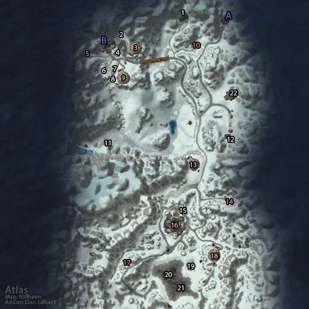

# 奥特兰克山谷 (北)

**位置:** 奥特兰克山脉  
**适用等级:** 51-60 (51+)  
**人数上限:** 40人  

## 关键点/首领
- 声望: Stormpike Guard
- A) 入口
- B) 丹巴达尔
- 范达尔·雷矛 ([掉落](#boss-11948))
- 丹巴达尔北部元帅 ([掉落](#boss-14762))
- 丹巴达尔南部元帅 ([掉落](#boss-14763))
- 冰翼元帅 ([掉落](#boss-14764))
- 石炉元帅 ([掉落](#boss-14765))
- 冰血元帅 ([掉落](#boss-14766))
- 哨塔高地元帅 ([掉落](#boss-14767))
- 霜狼东部统帅 ([掉落](#boss-14768))
- 西部霜狼元帅 ([掉落](#boss-14769))
- 勘察员塔雷·石镐 ([掉落](#boss-13816))
- 1) 深铁矿洞
- 莫洛克 (中立) ([掉落](#boss-11657))
- 乌米·托尔森 (Alliance) ([掉落](#boss-13078))
- 基塔尔 (Horde) ([掉落](#boss-13079))
- 2) 大德鲁伊雷弗拉尔 ([掉落](#boss-13442))
- 3) 丹巴达尔北部碉堡
- 空军指挥官穆维里克 (Horde) ([掉落](#boss-13181))
- 4) 莫高特·深炉 ([掉落](#boss-13257))
- 德尔克·斯温德尔 ([掉落](#boss-14188))
- 亚斯拉玛尼斯 ([掉落](#boss-14187))
- 兰纳·雷酒 ([掉落](#boss-4257))
- 5) 雷矛急救站
- 6) 雷矛兽栏管理员 ([掉落](#boss-13617))
- 雷矛山羊骑兵指挥官 ([掉落](#boss-13577))
- 斯瓦尔布莱德·远山 ([掉落](#boss-5135))
- 库德拉姆·麦须 ([掉落](#boss-5139))
- 7) 雷矛军需官 ([掉落](#boss-12096))
- 约尼维拉·远山 ([掉落](#boss-5134))
- 布罗古斯·雷酒 ([掉落](#boss-4255))
- 8) 空军指挥官艾克曼 (已营救) ([掉落](#boss-13437))
- 空军指挥官斯里多尔 (已营救) ([掉落](#boss-13438))
- 空军指挥官维波里 (已营救) ([掉落](#boss-13439))
- 9) 丹巴达尔南部碉堡
- 诺雷格·雷矛中尉 ([掉落](#boss-13447))
- 盖尔丁 ([掉落](#boss-13216))
- 10) 雷矛墓地
- 11) 冰翼洞穴
- 雷矛军旗
- 12) 雷矛伐木场
- 空军指挥官杰斯托 (Horde) ([掉落](#boss-13180))
- 13) 冰翼碉堡
- 空军指挥官古斯 (Horde) ([掉落](#boss-13179))
- 14) 石炉墓地
- 15) 雷矛山羊骑兵指挥官 ([掉落](#boss-13577))
- 16) 石炉哨站
- 巴琳达·斯通赫尔斯 ([掉落](#boss-11949))
- 17) 落雪墓地
- 艾克曼的信号灯
- 穆维里克的信号灯法术焦点 (Horde)
- 血怒者科尔拉克 ([掉落](#boss-12159))
- 18) 石炉碉堡
- 19) 森林之王伊弗斯 (召唤) ([掉落](#boss-13419))
- 20) 西部凹地
- 维波里的信号灯
- 杰斯托的信号灯 (Horde)
- 21) 东部凹地
- 斯里多尔的信号灯
- 古斯的信号灯 (Horde)
- 22) 蒸汽锯 (Horde)
- 
- 友善声望奖励
- 尊敬声望奖励
- 崇敬声望奖励
- 崇拜声望奖励
- 
- 红色: 墓地，可占领区域
- 橙色: 碉堡，塔楼，可摧毁区域
- 白色: 突袭NPC，任务区域

## 相关任务
### 联盟
- [战斗的召唤：奥特兰克山谷 (战场日常)](../quest/7261.md)
- [国王的命令](../quest/7162.md)
- [实验场](../quest/7141.md)
- [奥特兰克山谷的战斗](../quest/7121.md)
- [军需官](../quest/6982.md)
- [冷齿矿洞的补给](../quest/5892.md)
- [深铁矿洞的补给](../quest/7223.md)
- [护甲碎片](../quest/7122.md)
- [占领矿洞](../quest/7102.md)
- [哨塔和碉堡](../quest/7081.md)
- [奥特兰克山谷的墓地](../quest/7027.md)
- [补充坐骑](../quest/7026.md)
- [山羊坐具](../quest/7386.md)
- [水晶簇](../quest/6881.md)
- [森林之王伊弗斯](../quest/6942.md)
- [天空的召唤 - 维波里的空军](../quest/6941.md)
- [天空的召唤 - 斯里多尔的空军](../quest/6943.md)
### 部落
- [战斗的召唤：奥特兰克山谷 (战场日常)](../quest/7241.md)
- [保卫霜狼氏族](../quest/7161.md)
- [实验场](../quest/7142.md)
- [为奥特兰克而战](../quest/7123.md)
- [霜狼军需官](../quest/5893.md)
- [冷齿矿洞的补给](../quest/6985.md)
- [深铁矿洞的补给](../quest/7224.md)
- [敌人的物资](../quest/7124.md)
- [占领矿洞](../quest/7101.md)
- [哨塔和碉堡](../quest/7082.md)
- [奥特兰克山谷的墓地](../quest/7001.md)
- [补充坐骑](../quest/7002.md)
- [羊皮坐具](../quest/7385.md)
- [联盟之血](../quest/6801.md)
- [冰雪之王洛克霍拉](../quest/6825.md)
- [天空的召唤 - 古斯的部队](../quest/6826.md)
- [天空的召唤 - 杰斯托的部队](../quest/6827.md)
