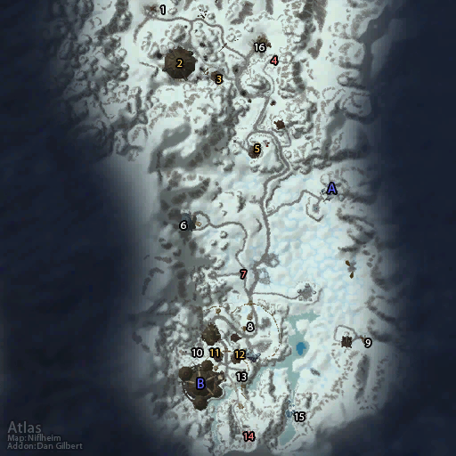

# 奥特兰克山谷 (南)

**位置:** 希尔斯布莱德丘陵  
**适用等级:** 51-60 (51+)  
**人数上限:** 40人  

## 关键点/首领
- 声望: Frostwolf Clan
- A) 入口 (Horde)
- B) 霜狼要塞
- 德雷克塔尔 ([掉落](#boss-11946))
- 杜洛斯 ([掉落](#boss-12122))
- 德拉坎 ([掉落](#boss-12121))
- 西部霜狼将领 ([掉落](#boss-14777))
- 东部霜狼将领 ([掉落](#boss-14772))
- 哨塔高地将领 ([掉落](#boss-14776))
- 冰血将领 ([掉落](#boss-14773))
- 石炉将领 ([掉落](#boss-14775))
- 冰翼将领 ([掉落](#boss-14774))
- 丹巴达尔北部将领 ([掉落](#boss-14770))
- 丹巴达尔南部将领 ([掉落](#boss-14771))
- 1) 冰雪之王洛克霍拉 (召唤) ([掉落](#boss-13256))
- 2) 冰血要塞
- 加尔范上尉 ([掉落](#boss-11947))
- 3) 冰血塔楼
- 4) 冰血墓地
- 空军指挥官艾克曼 (Alliance) ([掉落](#boss-13437))
- 5) 哨塔高地
- 空军指挥官斯里多尔 (Alliance) ([掉落](#boss-13438))
- 6) 冷齿矿洞
- 工头斯尼维尔 (中立) ([掉落](#boss-11677))
- 玛莎·迅切 (Horde) ([掉落](#boss-13088))
- 埃其·重脚 (Alliance) ([掉落](#boss-13086))
- 7) 霜狼墓地
- 8) 空军指挥官维波里 (Alliance) ([掉落](#boss-13439))
- 乔泰克 ([掉落](#boss-13798))
- 铁匠雷格萨 ([掉落](#boss-13176))
- 指挥官瑟鲁加 ([掉落](#boss-13236))
- 亚斯拉·血矛中士 ([掉落](#boss-13448))
- 9) 霜狼兽栏管理员 ([掉落](#boss-13616))
- 霜狼骑兵指挥官 ([掉落](#boss-13441))
- 10) 霜狼军需官 ([掉落](#boss-12097))
- 11) 西部霜狼塔楼
- 12) 东部霜狼塔楼
- 13) 空军指挥官古斯 (已营救) ([掉落](#boss-13179))
- 空军指挥官杰斯托 (已营救) ([掉落](#boss-13180))
- 空军指挥官穆维里克 (已营救) ([掉落](#boss-13181))
- 14) 霜狼急救站
- 15) 蛮爪洞穴
- 霜狼军旗
- 16) 蒸汽锯 (Alliance)
- 
- 友善声望奖励
- 尊敬声望奖励
- 崇敬声望奖励
- 崇拜声望奖励
- 
- 红色: 墓地，可占领区域
- 橙色: 碉堡，塔楼，可摧毁区域
- 白色: 突袭NPC，任务区域

## 相关任务
### 联盟
- [战斗的召唤：奥特兰克山谷 (战场日常)](../quest/7261.md)
- [国王的命令](../quest/7162.md)
- [实验场](../quest/7141.md)
- [奥特兰克山谷的战斗](../quest/7121.md)
- [军需官](../quest/6982.md)
- [冷齿矿洞的补给](../quest/5892.md)
- [深铁矿洞的补给](../quest/7223.md)
- [护甲碎片](../quest/7122.md)
- [占领矿洞](../quest/7102.md)
- [哨塔和碉堡](../quest/7081.md)
- [奥特兰克山谷的墓地](../quest/7027.md)
- [补充坐骑](../quest/7026.md)
- [山羊坐具](../quest/7386.md)
- [水晶簇](../quest/6881.md)
- [森林之王伊弗斯](../quest/6942.md)
- [天空的召唤 - 维波里的空军](../quest/6941.md)
- [天空的召唤 - 斯里多尔的空军](../quest/6943.md)
### 部落
- [战斗的召唤：奥特兰克山谷 (战场日常)](../quest/7241.md)
- [保卫霜狼氏族](../quest/7161.md)
- [实验场](../quest/7142.md)
- [为奥特兰克而战](../quest/7123.md)
- [霜狼军需官](../quest/5893.md)
- [冷齿矿洞的补给](../quest/6985.md)
- [深铁矿洞的补给](../quest/7224.md)
- [敌人的物资](../quest/7124.md)
- [占领矿洞](../quest/7101.md)
- [哨塔和碉堡](../quest/7082.md)
- [奥特兰克山谷的墓地](../quest/7001.md)
- [补充坐骑](../quest/7002.md)
- [羊皮坐具](../quest/7385.md)
- [联盟之血](../quest/6801.md)
- [冰雪之王洛克霍拉](../quest/6825.md)
- [天空的召唤 - 古斯的部队](../quest/6826.md)
- [天空的召唤 - 杰斯托的部队](../quest/6827.md)
