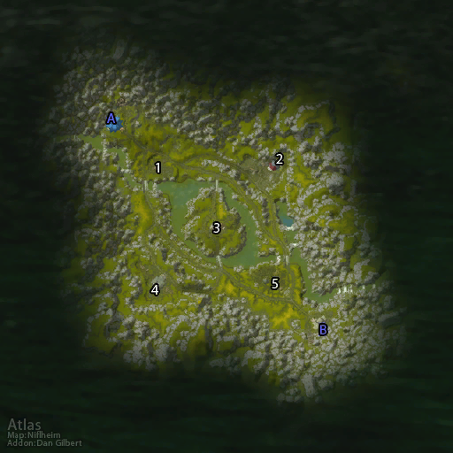

# 阿拉希盆地

**位置:** 阿拉希高地  
**适用等级:** 20-60 (20+)  
**人数上限:** 15人  

## 关键点/首领
- 声望: The Defilers (Horde)3
- 声望: The League of Arathor (Alliance)5
- A) 托尔贝恩大厅 (Alliance)2
- B) 污染者之穴 (Horde)2
- 1) 兽栏1
- 2) 金矿1
- 3) 铁匠铺1
- 4) 伐木场1
- 5) 农场1
- 0
- 友善声望奖励0
- 尊敬声望奖励0
- 崇敬声望奖励0
- 崇拜声望奖励0

## 相关任务
### 联盟
- [战斗的召唤：阿拉希盆地 (战场日常)](../quest/8105.md)
- [阿拉希盆地之战!](../quest/8114.md)
- [控制四座基地](../quest/8115.md)
### 部落
- [战斗的召唤：阿拉希盆地 (战场日常)](../quest/8169.md)
- [阿拉希盆地之战!](../quest/8121.md)
- [夺取四座基地](../quest/8122.md)
