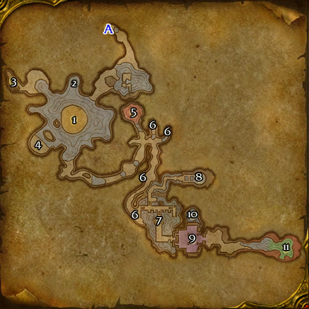

# 黑暗深渊

**位置:** 灰谷  
**适用等级:** 24-32 (19+)  
**人数上限:** 5人  

## 关键点/首领
- A) 入口
- 1) 加摩拉 ([掉落](#boss-4887))
- 2) 洛迦里斯手稿
- 3) 萨利维丝女士 ([掉落](#boss-4831))
- 4) 银月守卫塞尔瑞德 ([掉落](#boss-4787))
- 5) 格里哈斯特 ([掉落](#boss-6243))
- 格里哈斯特神殿
- 6) 洛古斯·杰特 (变化) ([掉落](#boss-12902))
- 7) 阿奎尼斯男爵 ([掉落](#boss-12876))
- 深渊之石
- 8) 污染者维尔塞拉克斯 ([掉落](#boss--1))
- 9) 梦游者克尔里斯 ([掉落](#boss-4832))
- 10) 老瑟拉吉斯 ([掉落](#boss-4830))
- 11) 阿库麦尔 ([掉落](#boss-4829))
- 莫瑞杜恩 ([掉落](#boss-6729))
- 玛塞斯特拉祭坛
- 
- 小怪

## 相关任务
### 联盟
- [深渊中的知识](../quest/971.md)
- [研究堕落](../quest/1275.md)
- [寻找塞尔瑞德](../quest/1198.md)
- [黑暗深渊中的恶魔](../quest/1200.md)
- [暮光之锤的末日](../quest/1199.md)
- [索兰鲁克宝珠（术士任务）](../quest/1740.md)
### 部落
- [阿库麦尔水晶](../quest/6563.md)
- [上古之神的仆从](../quest/6564.md)
- [废墟之间](../quest/6921.md)
- [黑暗深渊中的恶魔](../quest/6561.md)
- [索兰鲁克宝珠（术士任务）](../quest/1740.md)
- [阿奎尼斯男爵](../quest/6922.md)
