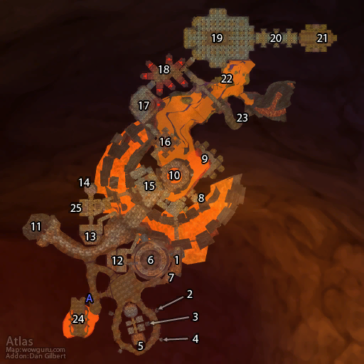

# 黑石深渊

**位置:** 黑石山  
**适用等级:** 52-60 (42+)  
**人数上限:** 5人  

## 关键点/首领
- 钥匙: 暗炉钥匙
- 钥匙: 监狱牢房钥匙
- 钥匙: 挑战之旗 (T0.5 召唤)
- A) 入口
- 1) 洛考尔 ([掉落](#boss-9025))
- 2) 卡兰·巨锤 ([掉落](#boss-9021))
- 3) 指挥官哥沙克 ([掉落](#boss-9020))
- 4) 温德索尔元帅 ([掉落](#boss-9023))
- 5) 审讯官格斯塔恩 ([掉落](#boss-9018))
- 6) 律法之环
- 阿努希尔 (随机) ([掉落](#boss-9031))
- 剜眼者 (随机) ([掉落](#boss-9029))
- 修行者高罗什 (随机) ([掉落](#boss-9027))
- 格里兹尔 (随机) ([掉落](#boss-9028))
- 爬行者赫杜姆 (随机) ([掉落](#boss-9032))
- 破坏者奥科索尔 (随机) ([掉落](#boss-9030))
- 瑟尔伦 (召唤) ([掉落](#boss-16059))
- 左撇 (Rogue) ([掉落](#boss-16049))
- 玛根·长矛 (Hunter) ([掉落](#boss-16052))
- 碎腭 (宠物) ([掉落](#boss-16095))
- 考尔夫 (Shaman) ([掉落](#boss-16050))
- 雷兹尼克 (工程师) ([掉落](#boss-16050))
- 烂牙 (Rogue) ([掉落](#boss-16050))
- 斯诺恩·黑骨 (Mage) ([掉落](#boss-16050))
- 瓦加什尼 (Priest) ([掉落](#boss-16055))
- 沃莉达 (Mage) ([掉落](#boss-16055))
- 驯犬者格雷布玛尔 (下层) ([掉落](#boss-9319))
- 晨深长者 (春节) ([掉落](#boss-15549))
- 裁决者格里斯通 ([掉落](#boss-10096))
- 7) 弗兰克罗恩·铸铁的雕像
- 控火师罗格雷恩 (稀有) ([掉落](#boss-9024))
- 8) 平民区
- 典狱官斯迪尔基斯 (稀有) ([掉落](#boss-9041))
- 维雷克 (稀有) ([掉落](#boss-9042))
- 卫兵杜格瑞普 ([掉落](#boss-9476))
- 9) 弗诺斯·达克维尔 ([掉落](#boss-9056))
- 10) 伊森迪奥斯 ([掉落](#boss-9017))
- 黑铁砧
- 11) 贝尔加 ([掉落](#boss-9016))
- 12) 暗炉锁
- 13) 安格弗将军 ([掉落](#boss-9033))
- 14) 傀儡统帅阿格曼奇 ([掉落](#boss-8983))
- 修理机器人74A型 ([掉落](#boss-14337))
- 锻造设计图
- 15) 冷酷酒鬼酒吧
- 霍尔雷·黑须 ([掉落](#boss-9537))
- 罗克图斯·暗契 ([掉落](#boss-12944))
- 娜玛拉小姐 ([掉落](#boss-9500))
- 法拉克斯 ([掉落](#boss-9502))
- 普拉格 ([掉落](#boss-9499))
- 罗克诺特下士 ([掉落](#boss-9503))
- 雷布里·斯库比格特 ([掉落](#boss-9543))
- 16) 弗莱拉斯大使 ([掉落](#boss-9156))
- 17) 无敌的潘佐尔 (稀有) ([掉落](#boss-8923))
- 锻造设计图
- 18) 召唤者之墓
- 七贤之箱
- 19) 讲学厅
- 20) 玛格姆斯 ([掉落](#boss-9938))
- 21) 达格兰·索瑞森大帝 ([掉落](#boss-9019))
- 铁炉堡公主茉艾拉·铜须 ([掉落](#boss-8929))
- 索瑞森高阶女祭司 ([掉落](#boss-10076))
- 22) 黑铁熔炉
- 23) 熔火之心
- 熔火碎片
- 24) 征服者派隆 ([掉落](#boss-9026))
- 25) 锻造设计图
- 
- 小怪
- 套装: The Gladiator
- 套装: Ironweave Battlesuit

## 相关任务
### 联盟
- [黑铁的遗产](../quest/3802.md)
- [雷布里·斯库比格特](../quest/4136.md)
- [爱情药水](../quest/4201.md)
- [霍尔雷·黑须](../quest/4126.md)
- [征服者派隆](../quest/4263.md)
- [伊森迪奥斯！](../quest/4123.md)
- [山脉之心](../quest/4286.md)
- [好东西](../quest/4241.md)
- [温德索尔元帅（奥妮克希亚系列任务）](../quest/4264.md)
- [弄皱的便笺（奥妮克希亚系列任务）](../quest/4282.md)
- [一丝希望（奥妮克希亚系列任务）](../quest/4322.md)
- [冲破牢笼！（奥妮克希亚系列任务）](../quest/4024.md)
- [烈焰精华](../quest/4341.md)
- [卡兰·巨锤](../quest/4362.md)
- [王国的命运](../quest/7848.md)
- [熔火之心的传送门](../quest/9015.md)
- [挑战（T0.5升级任务）](../quest/4083.md)
- [鬼魂之杯（采矿任务）](../quest/40757.md)
- [黑铁亵渎者](../quest/40762.md)
- [参议员复仇](../quest/40464.md)
- [奥术傀儡核心](../quest/40467.md)
- [建造一个重击者](../quest/80401.md)
- [冬幕节酒。](../quest/40748.md)
### 部落
- [黑铁的遗产](../quest/3802.md)
- [雷布里·斯库比格特](../quest/4136.md)
- [爱情药水](../quest/4201.md)
- [遗失的雷酒秘方](../quest/4134.md)
- [山脉之心](../quest/4123.md)
- [格杀勿论：黑铁矮人](../quest/4081.md)
- [格杀勿论：高阶黑铁军官](../quest/4082.md)
- [行动：杀死安格弗将军](../quest/4132.md)
- [机器的崛起](../quest/4063.md)
- [烈焰精华](../quest/4024.md)
- [不和谐的烈焰](../quest/3907.md)
- [不和谐的火焰](../quest/7201.md)
- [最后的元素](../quest/3981.md)
- [指挥官哥沙克](../quest/4003.md)
- [拯救公主](../quest/7848.md)
- [熔火之心的传送门](../quest/9015.md)
- [挑战（T0.5升级任务）](../quest/4083.md)
- [鬼魂之杯（采矿任务）](../quest/40757.md)
- [黑铁亵渎者](../quest/40762.md)
- [参议员复仇](../quest/40464.md)
- [奥术傀儡核心](../quest/40467.md)
- [建造一个重击者](../quest/80401.md)
- [冬幕节酒。](../quest/40748.md)
