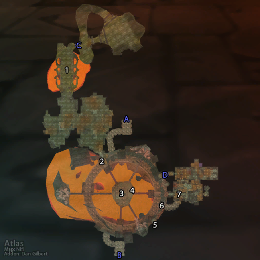

# 黑石山 (入口)

**位置:** 黑石山  
**适用等级:** ?? (??+)  
**人数上限:** ??人  

## 关键点/首领
- A) 灼热峡谷1
- B) 燃烧平原1
- C) 黑石深渊 (BRD)2
- 熔火之心 (MC) (穿过BRD)2
- D) 黑石塔下层 (LBRS)2
- 黑石塔上层 (UBRS)1
- 黑翼之巢 (BWL) (穿过UBRS)2
- [布德利 (鬼魂)](../npc/16033.md)
- [1) 征服者派隆 (游荡)](../npc/9026.md)
- [2) 洛索斯·天痕 (MC 传送)](../npc/14387.md)
- [3) 弗兰克罗恩·铸铁 (鬼魂)](../npc/8888.md)
- 4) 集合石 (BRD)2
- 5) 命令宝珠 (BWL 传送)3
- 6) 集合石 (LBRS, UBRS)3
- [7) 裂盾军需官 (稀有)](../npc/9046.md)
