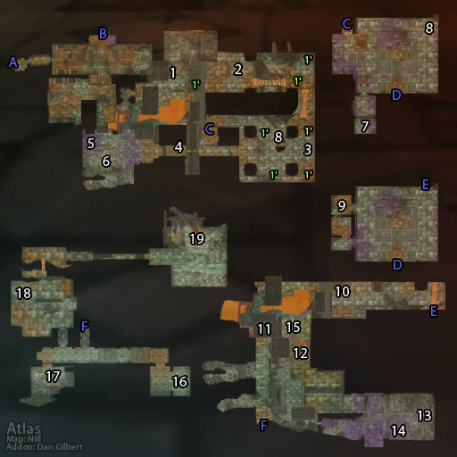

# 黑石塔下层

**位置:** 黑石山  
**适用等级:** 55-60 (55+)  
**人数上限:** 10人  

## 关键点/首领
- 钥匙: 符咒火盆 (T0.5 召唤)3
- A) 入口1
- B) 黑石塔上层 (UBRS)2
- C-F) 连接点1
- [1) 维埃兰 (上层)](../npc/10296.md)
- [2) 瓦罗什 (游荡)](../npc/10799.md)
- [石垒长者 (春节)](../npc/15560.md)
- 3) 尖锐长矛1
- [4) 尖石屠夫 (稀有)](../npc/9219.md)
- [5) 欧莫克大王](../npc/9196.md)
- [6) 尖石统帅 (稀有)](../npc/9218.md)
- [尖石首席法师 (稀有)](../npc/9217.md)
- [7) 暗影猎手沃许加斯](../npc/9236.md)
- 第五块摩沙鲁石板0
- [8) 比修](../npc/10257.md)
- [9) 指挥官沃恩](../npc/9237.md)
- [莫尔·灰蹄 (召唤)](../npc/16080.md)
- 第六块摩沙鲁石板0
- 10) 比修的装置1
- 11) 人类遗骸 (下层)2
- 未淬火的板甲护手 (下层)1
- [12) 班诺克·巨斧 (稀有)](../npc/9596.md)
- [13) 烟网蛛后](../npc/10596.md)
- [14) 水晶之牙 (稀有)](../npc/10376.md)
- 15) 乌洛克的贡品堆1
- [乌洛克 (召唤)](../npc/10584.md)
- [16) 军需官兹格雷斯](../npc/9736.md)
- [17) 哈雷肯](../npc/10220.md)
- [奴役者基兹卢尔](../npc/10268.md)
- [18) 霍克·巴什古德 (稀有)](../npc/9718.md)
- [19) 维姆萨拉克](../npc/9568.md)
- [1') 燃烧恶魔守卫 (稀有, 召唤)](../npc/10263.md)
- 0
- 小怪0
- 套装: Ironweave Battlesuit2
- 套装: Spider's Kiss2
- 套装: T0/T0.5 套装2

## 相关任务
### 联盟
- [最后的石板](../quest/4788.md)
- [基布雷尔的特殊宠物](../quest/4729.md)
- [蜘蛛卵](../quest/4862.md)
- [蛛后的乳汁](../quest/4866.md)
- [座狼之源](../quest/4701.md)
- [乌洛克](../quest/4867.md)
- [比修的装置](../quest/5001.md)
- [麦克斯韦尔的任务](../quest/5081.md)
- [晋升印章](../quest/4742.md)
- [达基萨斯将军的命令](../quest/5089.md)
- [瓦塔拉克饰品的左瓣](../quest/8966.md)
- [瓦塔拉克饰品的右瓣](../quest/8989.md)
- [沃什加斯的蛇石（锻造-铸剑大师任务）](../quest/5306.md)
- [火热的死亡](../quest/5103.md)
- [黑铁亵渎者](../quest/40762.md)
### 部落
- [最后的石板](../quest/4788.md)
- [基布雷尔的特殊宠物](../quest/4729.md)
- [蜘蛛卵](../quest/4862.md)
- [蛛后的乳汁](../quest/4866.md)
- [座狼的首领](../quest/4724.md)
- [乌洛克](../quest/4867.md)
- [狡猾的比修](../quest/4981.md)
- [比修的装置](../quest/4982.md)
- [晋升印章](../quest/4742.md)
- [高图斯的命令](../quest/4903.md)
- [瓦塔拉克饰品的左瓣](../quest/8966.md)
- [瓦塔拉克饰品的右瓣](../quest/8989.md)
- [沃什加斯的蛇石（锻造-铸剑大师任务）](../quest/5306.md)
- [火热的死亡](../quest/5103.md)
- [黑铁亵渎者](../quest/40762.md)
- [森林巨魔的败类](../quest/40495.md)
- [掠夺者的突袭](../quest/40498.md)
- [最后的裂缝](../quest/40509.md)
