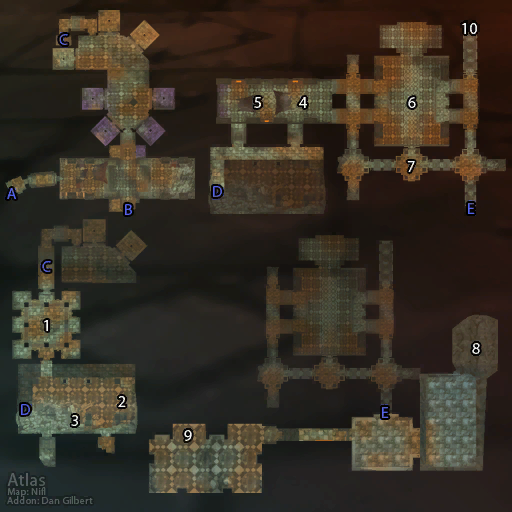

# 黑石塔上层

**位置:** 黑石山  
**适用等级:** 55-60 (55+)  
**人数上限:** 10人  

## 关键点/首领
- 钥匙: 晋升印章
- 钥匙: 符咒火盆 (T0.5 召唤)
- A) 入口
- B) 黑石塔下层 (LBRS)
- C-E) 连接点
- 1) 烈焰卫士艾博希尔 ([掉落](#boss-9816))
- 2) 索拉卡·火冠 ([掉落](#boss-10264))
- 烈焰之父
- 3) 黑暗石板
- 末日扣环之箱
- 4) 杰德 (稀有) ([掉落](#boss-10509))
- 5) 古拉鲁克 (稀有) ([掉落](#boss-10899))
- 6) 大酋长雷德·黑手 ([掉落](#boss-10429))
- 盖斯 ([掉落](#boss-10339))
- 7) 奥比 ([掉落](#boss-10740))
- 8) 比斯巨兽 ([掉落](#boss-10430))
- 瓦萨拉克 (召唤) ([掉落](#boss-16042))
- 芬克·恩霍尔 ([掉落](#boss-10776))
- 9) 达基萨斯将军 ([掉落](#boss-10363))
- 达基萨斯的烙印
- 10) 黑翼之巢 (BWL)
- 
- 小怪
- 套装: Ironweave Battlesuit
- T0/T0.5 套装

## 相关任务
### 联盟
- [监护者](../quest/5160.md)
- [芬克·恩霍尔，为您效劳！](../quest/5047.md)
- [冷冻龙蛋](../quest/4734.md)
- [艾博希尔之眼](../quest/6821.md)
- [达基萨斯将军之死](../quest/5102.md)
- [末日扣环](../quest/4764.md)
- [龙火护符](../quest/6502.md)
- [黑手的命令](../quest/7761.md)
- [最后的准备](../quest/8994.md)
- [瓦塔拉克公爵](../quest/8995.md)
- [恶魔熔炉（煅造-铸甲大师任务）](../quest/5127.md)
- [护腕的上半部分之一](../quest/41011.md)
### 部落
- [监护者](../quest/5160.md)
- [芬克·恩霍尔，为您效劳！](../quest/5047.md)
- [冷冻龙蛋](../quest/4734.md)
- [艾博希尔之眼](../quest/6821.md)
- [黑暗石板](../quest/4768.md)
- [为部落而战！](../quest/4974.md)
- [黑龙幻像](../quest/6569.md)
- [黑龙勇士之血](../quest/6602.md)
- [黑手的命令](../quest/7761.md)
- [最后的准备](../quest/8994.md)
- [瓦塔拉克公爵](../quest/8995.md)
- [恶魔熔炉](../quest/5127.md)
- [护腕的上半部分之一](../quest/41011.md)
