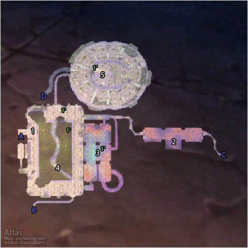
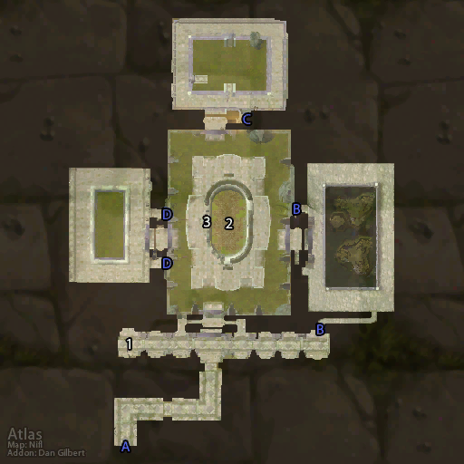

# 厄运之槌 (东)

**位置:** 菲拉斯  
**适用等级:** 55-58 (50+)  
**人数上限:** 5人  

## 关键点/首领
- 钥匙: 符咒火盆 (T0.5 召唤)3
- A) 入口1
- B) 入口1
- C) 入口1
- D) 出口1
- [1) 普希林 (追逐开始)](../npc/14354.md)
- [2) 普希林 (追逐结束)](../npc/14354.md)
- [3) 瑟雷姆·刺蹄](../npc/11490.md)
- [海多斯博恩](../npc/13280.md)
- [蕾瑟塔蒂丝](../npc/14327.md)
- [匹姆吉布](../npc/14349.md)
- [4) 老铁皮](../npc/11491.md)
- [5) 奥兹恩](../npc/11492.md)
- [伊萨利恩 (召唤)](../npc/16097.md)
- 魔藤碎片0
- 1') 布满灰尘的书籍 (变化)2
- 0
- 小怪0
- 厄运之槌书籍0
- 套装: Ironweave Battlesuit2

## 相关任务
### 联盟
- [普希林和埃斯托尔迪](../quest/7441.md)
- [蕾瑟塔蒂丝的网](../quest/7488.md)
- [魔藤碎片](../quest/5526.md)
- [瓦塔拉克饰品的左瓣](../quest/8967.md)
- [瓦塔拉克饰品的右瓣](../quest/8990.md)
- [监牢之链（术士任务）](../quest/7581.md)
- [狂野变形者](../quest/41016.md)
### 部落
- [普希林和埃斯托尔迪](../quest/7441.md)
- [蕾瑟塔蒂丝的网](../quest/7489.md)
- [魔藤碎片](../quest/5526.md)
- [瓦塔拉克饰品的左瓣](../quest/8967.md)
- [瓦塔拉克饰品的右瓣](../quest/8990.md)
- [监牢之链（术士任务）](../quest/7581.md)
- [狂野变形者](../quest/41016.md)
