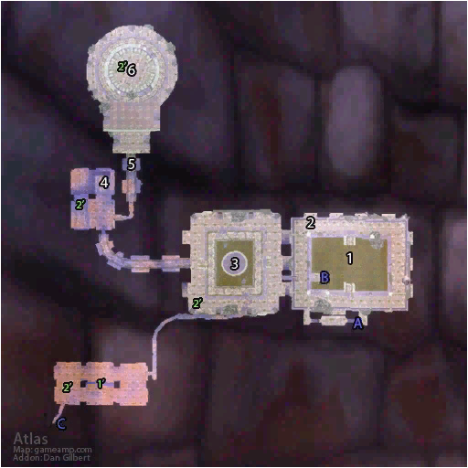

# 厄运之槌 (北)

**位置:** 菲拉斯  
**适用等级:** 57-60 (50+)  
**人数上限:** 5人  

## 关键点/首领
- 钥匙: 月牙钥匙1
- 钥匙: 戈多克庭院钥匙1
- 钥匙: 戈多克内门钥匙1
- A) 入口1
- B) 图书馆1
- C) 厄运之槌 (西)2
- [1) 卫兵摩尔达](../npc/14326.md)
- [2) 践踏者克雷格](../npc/14322.md)
- [3) 卫兵芬古斯](../npc/14321.md)
- [4) 诺特·希姆加克](../npc/14338.md)
- [卫兵斯里基克](../npc/14323.md)
- [5) 克罗卡斯](../npc/14325.md)
- [6) 戈多克大王](../npc/11501.md)
- [观察者克鲁什](../npc/14324.md)
- 1') 图书馆1
- [法琳·树形者](../npc/16032.md)
- [博学者莱德罗斯](../npc/14368.md)
- [博学者亚沃](../npc/14381.md)
- [博学者基尔达斯](../npc/14383.md)
- [博学者麦库斯](../npc/14382.md)
- [辛德拉圣职者](../npc/14371.md)
- 卡里尔·温萨鲁斯的骸骨0
- 2') 布满灰尘的书籍 (变化)2
- 0
- 小怪0
- 厄运之槌书籍0
- 贡品流程0

## 相关任务
### 联盟
- [破碎的陷阱](../quest/1193.md)
- [戈多克食人魔装](../quest/5519.md)
- [救诺特出去！](../quest/7429.md)
- [戈多克食人魔的事务](../quest/7703.md)
### 部落
- [破碎的陷阱](../quest/1193.md)
- [戈多克食人魔装](../quest/5519.md)
- [救诺特出去！](../quest/7429.md)
- [戈多克食人魔的事务](../quest/7703.md)
