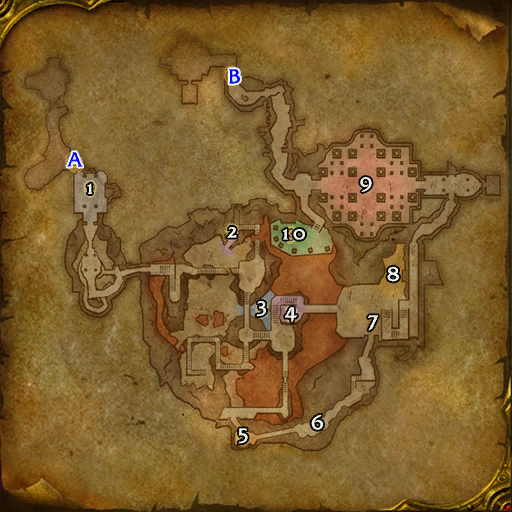

# 龙喉居所

**位置:** 湿地  
**适用等级:** 25-35 (25+)  
**人数上限:** 5人  

## 关键点/首领
- A) 入口1
- B) 出口1
- 1) 孤峰1
- 2) 穴织女王1
- 3) 织网大师托尔康1
- 4) 卡洛克·护火者1
- 5) 哈尔甘·红标1
- 6) 渣拳毁灭者1
- 7) 黑心大王1
- 8) 长者空血1
- 9) 希瑞斯塔萨1
- 10) 酋长塔尔加斯·龙颅1
- 0
- 小怪0

## 相关任务
### 联盟
- [粉碎龙喉](../quest/41756.md)
- [黑心的毁灭](../quest/41757.md)
- [红标谎言(Part I)](../quest/41754.md)
- [红标谎言 (Part II)](../quest/41755.md)
- [来自科尔拉格·末日之歌的信](../quest/41883.md)
- [龙喉的毁灭](../quest/41884.md)
- [孤峰之败](../quest/41750.md)
- [石傀儡回收](../quest/41749.md)
- [红龙女王的枷锁](../quest/41785.md)
- [龙喉之巢](../quest/41751.md)
- [联合基座](../quest/41774.md)
### 部落
- [穴织精萃](../quest/41752.md)
- [永不熄灭的烈焰](../quest/41753.md)
- [来自科尔拉格·末日之歌的信](../quest/41657.md)
- [龙喉的毁灭](../quest/41658.md)
- [孤峰之败](../quest/41750.md)
- [石傀儡回收](../quest/41749.md)
- [红龙女王的枷锁](../quest/41785.md)
- [龙喉之巢](../quest/41751.md)
- [联合基座](../quest/41774.md)
