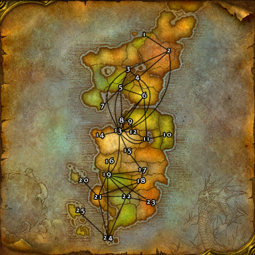

# Alliance (东部王国)

**位置:** 东部王国  
**适用等级:** ?? (??+)  
**人数上限:** ??人  

## 关键点/首领
- 1) 阿尔萨拉斯, 萨拉斯高地
- 2) 圣光之愿礼拜堂, 东瘟疫之地
- 3) 冰风岗, 西瘟疫之地
- 4) 鹰巢山, 辛特兰
- 5) 南海镇, 希尔斯布莱德丘陵
- 6) 避难谷地, 阿拉希高地
- 7) 拉文郡, 吉尔尼斯
- 8) 米奈希尔港, 湿地
- 9) 丹阿格拉斯, 湿地
- 10) 丹基塔斯, 冷酷海岸
- 11) 塞尔萨玛, 洛克莫丹
- 12) 铁炉堡机场, 丹莫罗
- 13) 铁炉堡, 丹莫罗
- 14) 诺莫瑞根复兴城, 丹莫罗
- 15) 瑟银哨塔, 灼热峡谷
- 16) 安伯郡, 北风领
- 17) 摩根的岗哨, 燃烧平原
- 18) 湖畔镇, 赤脊山
- 19) 暴风城, 艾尔文森林
- 20) 军情七处哨站, 巴洛
- 21) 哨兵岭, 西部荒野
- 22) 夜色镇, 暮色森林
- 23) 守望堡, 诅咒之地
- 24) 藏宝海湾, 荆棘谷
- 25) 卡兰之墓, 拉匹迪斯之岛
