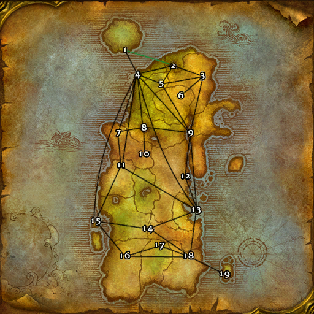

# Alliance (卡利姆多)

**位置:** 卡利姆多  
**适用等级:** ?? (??+)  
**人数上限:** ??人  

## 关键点/首领
- 1) 鲁瑟兰村, 泰达希尔2
- 2) 永夜港, 月光林地 (仅德鲁伊)3
- 艾露恩湖沿岸道路以南, 月光林地1
- 3) 永望镇, 冬泉谷2
- 4) 奥伯丁, 黑海岸2
- 5) 刺枝林地, 费伍德森林2
- 6) 诺达纳尔, 海加尔山2
- 7) 石爪峰, 石爪山脉2
- 8) 阿斯特兰纳, 灰谷2
- 9) 塔伦迪斯营地, 艾萨拉2
- 10) 贝尔哈杜尔, 石爪山脉2
- 11) 尼耶尔前哨站, 凄凉之地2
- 12) 棘齿城, 贫瘠之地2
- 13) 塞拉摩岛, 尘泥沼泽2
- 14) 萨兰纳尔, 菲拉斯2
- 15) 羽月要塞, 菲拉斯2
- 16) 塞纳里奥要塞, 希利苏斯2
- 17) 马绍尔营地, 安戈洛环形山2
- 18) 加基森, 塔纳利斯2
- 19) 特尔公司营地, 泰拉比姆2
