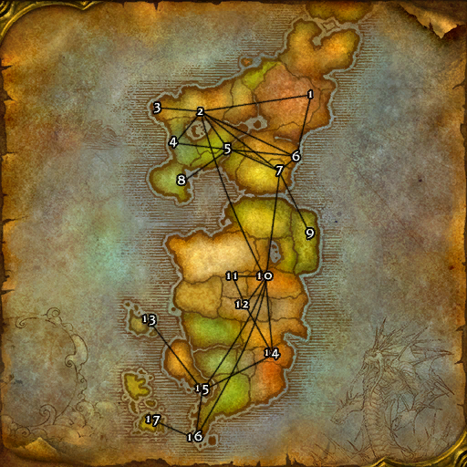

# Horde (东部王国)

**位置:** 东部王国  
**适用等级:** ?? (??+)  
**人数上限:** ??人  

## 关键点/首领
- 1) 圣光之愿礼拜堂, 东瘟疫之地
- 2) 幽暗城, 提瑞斯法林地
- 3) 陡崖港, 提瑞斯法林地
- 4) 瑟伯切尔, 银松森林
- 5) 塔伦米尔, 希尔斯布莱德丘陵
- 6) 恶齿村, 辛特兰
- 7) 落锤镇, 阿拉希高地
- 8) 寂静守卫教堂, 吉尔尼斯
- 9) 岩须港, 冷酷海岸
- 10) 卡加斯, 荒芜之地
- 11) 瑟银哨塔, 灼热峡谷
- 12) 烈焰峰, 燃烧平原
- 13) 暴掠角, 巴洛
- 14) 斯通纳德, 悲伤沼泽
- 15) 格罗姆高营地, 荆棘谷
- 16) 藏宝海湾, 荆棘谷
- 17) 莫尔奥格避难所, 吉利吉姆之岛
