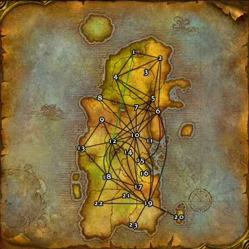

# Horde (卡利姆多)

**位置:** 卡利姆多  
**适用等级:** ?? (??+)  
**人数上限:** ??人  

## 关键点/首领
- 1) 永夜港, 月光林地 (仅德鲁伊)
- 通往木喉要塞的道路以西, 月光林地
- 2) 永望镇, 冬泉谷
- 3) 诺达纳尔, 海加尔山
- 4) 血毒岗哨, 费伍德森林
- 5) 瓦罗莫克, 艾萨拉
- 6) 奥格瑞玛, 杜隆塔尔
- 7) 碎木岗哨, 灰谷
- 8) 佐拉姆加前哨站, 灰谷
- 9) 烈日石居, 石爪山脉
- 10) 十字路口, 贫瘠之地
- 11) 棘齿城, 贫瘠之地
- 12) 雷霆崖, 莫高雷
- 13) 葬影村, 凄凉之地
- 14) 陶拉祖营地, 贫瘠之地
- 15) 蕨墙村, 尘泥沼泽
- 16) 泥链镇, 尘泥沼泽
- 17) 乱风岗, 千针石林
- 18) 莫沙彻营地, 菲拉斯
- 19) 加基森, 塔纳利斯
- 20) 特尔公司营地, 泰拉比姆
- 21) 马绍尔营地, 安戈洛环形山
- 22) 塞纳里奥要塞, 希利苏斯
- 23) 滑芯石油钻井平台, 塔纳利斯
