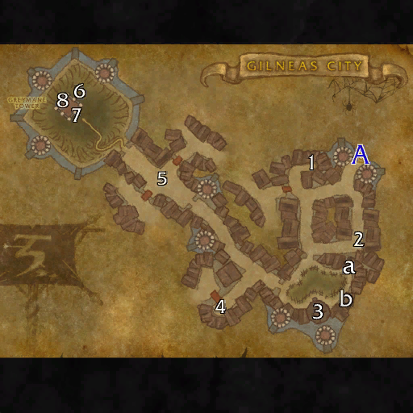

# 吉尔尼斯城

**位置:** 吉尔尼斯  
**适用等级:** 43-49 (43+)  
**人数上限:** 5人  

## 关键点/首领
- A) 入口1
- [1) 马蒂亚斯·霍尔茨](../npc/61419.md)
- [2) 兽群首领怒牙](../npc/61420.md)
- a) 黎明石计划1
- b) 水占术手稿第二卷1
- [3) 萨瑟兰法官](../npc/61421.md)
- [4) 达斯蒂万·布莱克考尔](../npc/61422.md)
- [5) 元帅马格努斯·格雷斯通](../npc/61423.md)
- [6) 御马司莱文](../npc/61605.md)
- 7) 哈洛家庭宝箱1
- [8) 吉恩·格雷迈恩](../npc/61418.md)
- 0
- 小怪0

## 相关任务
### 联盟
- [审判与幻影](../quest/40975.md)
- [墙后](../quest/40841.md)
- [拉文郡地契](../quest/40966.md)
- [拉文克罗夫特的野心](../quest/41112.md)
- [抹除龙类的存在](../quest/40943.md)
- [格雷迈恩的衰落与崛起](../quest/40956.md)
- [《水占术手稿II》](../quest/41114.md)
### 部落
- [审判与幻影](../quest/40975.md)
- [埃博米尔事务](../quest/40979.md)
- [皇家抢劫案](../quest/41113.md)
- [邪恶让我这样做](../quest/40881.md)
- [吉恩·格雷迈恩必须死！](../quest/40849.md)
- [格雷迈恩之石](../quest/40996.md)
