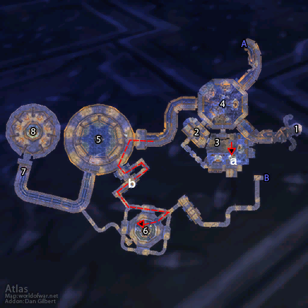
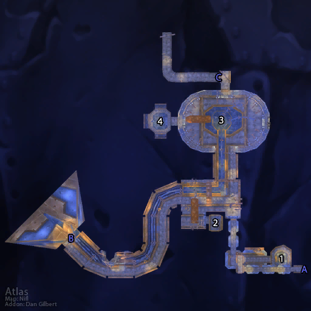

# 诺莫瑞根

**位置:** 丹莫罗  
**适用等级:** 29-38 (19+)  
**人数上限:** 5人  

## 关键点/首领
- 钥匙: 车间钥匙 (背部)2
- A) 入口 (前部)2
- B) 入口 (后退)2
- [1) 爆破专家艾米·短线](../npc/7998.md)
- [格鲁比斯](../npc/7361.md)
- [咀嚼者](../npc/6215.md)
- 2) 洁净室1
- [丁克·铁哨](../npc/9676.md)
- 超级清洁器5200型0
- 邮箱0
- [3) 克努比](../npc/7850.md)
- [警报炸弹2600型](../npc/7897.md)
- 矩阵式打孔计算机3005-B0
- [4) 粘性辐射尘](../npc/7079.md)
- [5) 电刑器6000型](../npc/6235.md)
- 矩阵式打孔计算机3005-C0
- [6) 群体打击者9-60 (上层)](../npc/6229.md)
- 矩阵式打孔计算机3005-D0
- [7) 黑铁大师 (稀有)](../npc/6228.md)
- [8) 制造者瑟玛普拉格](../npc/7800.md)
- 0
- 小怪0

## 相关任务
### 联盟
- [拯救尖端机器人！](../quest/2922.md)
- [诺恩](../quest/2926.md)
- [更多的辐射尘！](../quest/2962.md)
- [陀螺式挖掘机](../quest/2928.md)
- [基础模组](../quest/2924.md)
- [抢救数据](../quest/2930.md)
- [一团混乱](../quest/2904.md)
- [大叛徒](../quest/2929.md)
- [脏兮兮的戒指](../quest/2945.md)
- [戒指归来](../quest/2949.md)
- [一个沉重的大脑](../quest/80398.md)
- [高能调节器](../quest/40861.md)
- [备份系统激活](../quest/40856.md)
### 部落
- [出发！诺莫瑞根！](../quest/2843.md)
- [一团混乱](../quest/2904.md)
- [设备之战](../quest/2841.md)
- [脏兮兮的戒指](../quest/2945.md)
- [戒指归来](../quest/2949.md)
- [一个沉重的大脑](../quest/80398.md)
- [后备电源](../quest/55006.md)
