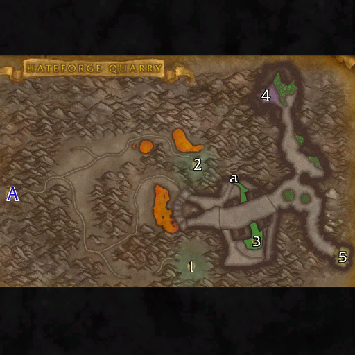

# 仇恨熔炉采石场

**位置:** 燃烧平原  
**适用等级:** 52-60 (48+)  
**人数上限:** 5人  

## 关键点/首领
- A) 入口1
- [1) 高级工头巴古·黑锤](../npc/60735.md)
- [2) 工程师菲格尔斯](../npc/60736.md)
- a) 仇恨熔炉化学文档1
- [3) 腐蚀西斯](../npc/60829.md)
- [4) 憎恨歼灭者](../npc/60734.md)
- [5) 哈格什·末日召唤者](../npc/60737.md)
- 0
- 小怪0

## 相关任务
### 联盟
- [竞争对手的存在](../quest/40458.md)
- [矿工工会叛变II](../quest/40468.md)
- [真正的高级工头](../quest/40463.md)
- [仇恨熔炉啤酒的传闻](../quest/40490.md)
- [攻击仇恨熔炉](../quest/40489.md)
- [为什么不两者兼得？](../quest/41142.md)
### 部落
- [竞争对手的存在](../quest/40458.md)
- [矿工工会叛变II](../quest/40468.md)
- [真正的高级工头](../quest/40463.md)
- [猎杀工程师菲格尔斯](../quest/40539.md)
- [新与旧之四](../quest/40504.md)
