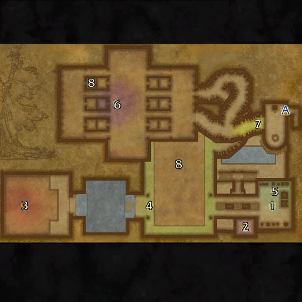

# 卡拉赞墓穴

**位置:** 逆风小径  
**适用等级:** 58-60 (58+)  
**人数上限:** 5人  

## 关键点/首领
- A) 入口1
- [1) 髓刺](../npc/91920.md)
- [2) 西瓦克西斯](../npc/91929.md)
- [3) 嚼尸鬼](../npc/91917.md)
- [4) 卫兵长高尔特](../npc/92935.md)
- [5) 大巫妖安克瑞兹](../npc/91916.md)
- [6) 指挥官安德里昂](../npc/91919.md)
- [7) 阿拉鲁斯](../npc/91928.md)
- 8) 半埋宝箱1
- 小怪0

## 相关任务
### 联盟
- [卡拉赞之谜之七](../quest/40317.md)
### 部落
- [卡拉赞深渊之七](../quest/40310.md)
