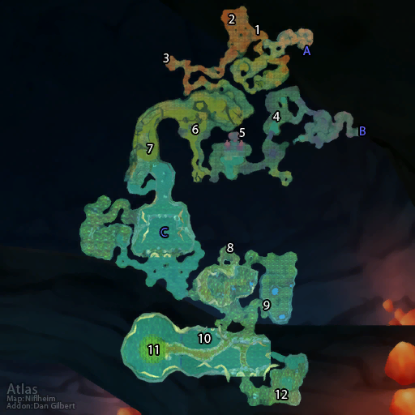

# 玛拉顿

**位置:** 凄凉之地  
**适用等级:** 46-55 (35+)  
**人数上限:** 5人  

## 关键点/首领
- 钥匙: 塞雷布拉斯节杖 (传送门)
- A) 入口 (橙色)
- B) 入口 (紫色)
- C) 入口 (传送门)
- 1) 温格 ([掉落](#boss-13738))
- 2) 诺克赛恩 ([掉落](#boss-13282))
- 3) 锐刺鞭笞者 ([掉落](#boss-12258))
- 4) 玛拉多斯 ([掉落](#boss-13739))
- 5) 维利塔恩 ([掉落](#boss-12236))
- 6) 收割者麦什洛克 (稀有) ([掉落](#boss-12237))
- 7) 被诅咒的塞雷布拉斯 ([掉落](#boss-12225))
- 8) 兰斯利德 ([掉落](#boss-12203))
- 9) 工匠吉兹洛克 ([掉落](#boss-13601))
- 10) 洛特格里普 ([掉落](#boss-13596))
- 11) 瑟莱德丝公主 ([掉落](#boss-12201))
- 12) 裂石长者 (春节) ([掉落](#boss-15556))

## 相关任务
### 联盟
- [暗影残片](../quest/7070.md)
- [维利塔恩的污染](../quest/7041.md)
- [扭曲的邪恶](../quest/7028.md)
- [贱民的指引](../quest/7067.md)
- [玛拉顿的传说](../quest/7044.md)
- [塞雷布拉斯节杖](../quest/7046.md)
- [大地的污染](../quest/7065.md)
- [生命之种](../quest/7066.md)
- [奇美兰的挽具](../quest/41052.md)
- [为什么不两者兼得？](../quest/41142.md)
### 部落
- [暗影残片](../quest/7068.md)
- [维利塔恩的污染](../quest/7029.md)
- [扭曲的邪恶](../quest/7028.md)
- [贱民的指引](../quest/7067.md)
- [玛拉顿的传说](../quest/7044.md)
- [塞雷布拉斯节杖](../quest/7046.md)
- [大地的污染](../quest/7064.md)
- [生命之种](../quest/7066.md)
