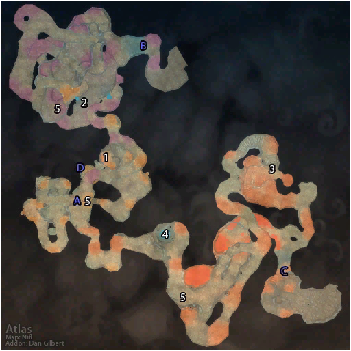

# 玛拉顿 (入口)

**位置:** 凄凉之地  
**适用等级:** ?? (??+)  
**人数上限:** ??人  

## 关键点/首领
- A) 入口
- 无名预言者 ([掉落](#boss-13718))
- B) 玛拉顿 (紫色)
- C) 玛拉顿 (橙色)
- D) 玛拉顿 (传送门)
- 1) 考尔克 ([掉落](#boss-13742))
- 2) 吉尔克 ([掉落](#boss-13741))
- 3) 玛格拉 ([掉落](#boss-13740))
- 4) 凯雯德拉 ([掉落](#boss-13697))
- 5) 被诅咒的半人马 (稀有, 变化) ([掉落](#boss-11688))

## 相关任务
### 联盟
- [暗影残片](../quest/7070.md)
- [维利塔恩的污染](../quest/7041.md)
- [扭曲的邪恶](../quest/7028.md)
- [贱民的指引](../quest/7067.md)
- [玛拉顿的传说](../quest/7044.md)
- [塞雷布拉斯节杖](../quest/7046.md)
- [大地的污染](../quest/7065.md)
- [生命之种](../quest/7066.md)
- [奇美兰的挽具](../quest/41052.md)
- [为什么不两者兼得？](../quest/41142.md)
### 部落
- [暗影残片](../quest/7068.md)
- [维利塔恩的污染](../quest/7029.md)
- [扭曲的邪恶](../quest/7028.md)
- [贱民的指引](../quest/7067.md)
- [玛拉顿的传说](../quest/7044.md)
- [塞雷布拉斯节杖](../quest/7046.md)
- [大地的污染](../quest/7064.md)
- [生命之种](../quest/7066.md)
