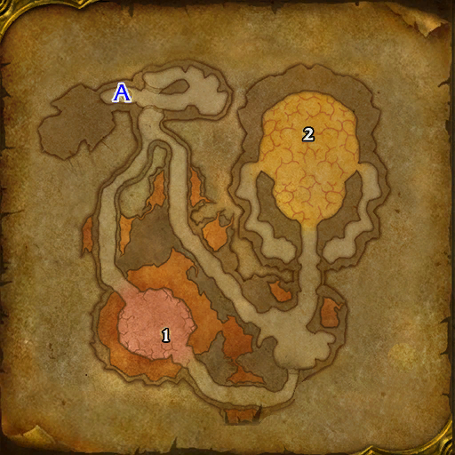

# 奥妮克希亚的巢穴

**位置:** 尘泥沼泽  
**适用等级:** 60+ (60+)  
**人数上限:** 40人  

## 关键点/首领
- 需要开门任务0
- 钥匙: 龙火护符1
- A) 入口1
- 1) 巢穴指挥官阿克塞勒斯1
- [2) 奥妮克希亚](../npc/10184.md)
- 0
- 伤害: 火焰1

## 相关任务
### 联盟
- [铸造奎尔塞拉](../quest/7509.md)
- [联盟的胜利](../quest/7495.md)
- [唯一的方案](../quest/8620.md)
### 部落
- [铸造奎尔塞拉](../quest/7509.md)
- [部落的胜利](../quest/7490.md)
- [唯一的方案](../quest/8620.md)
