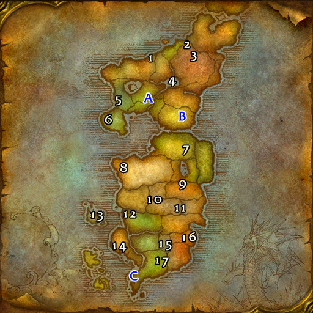
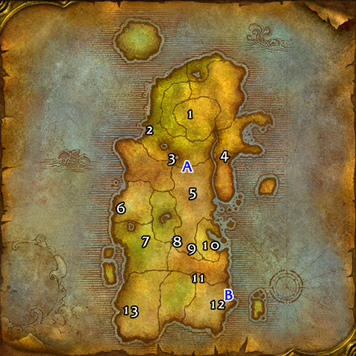

# 副本列表

## 地下城位置 (东部王国)

| 编号 | 副本名称 | 类型 | 区域 | 等级范围 |
| :---: | :--- | :---: | :--- | :---: |
| A | [奥特兰克山谷 (北)](AlteracValleyNorth.md) | PVP战场 | 奥特兰克山脉 | 51-60 |
| A | [奥特兰克山谷 (南)](AlteracValleySouth.md) | PVP战场 | 希尔斯布莱德丘陵 | 51-60 |
| B | [阿拉希盆地](ArathiBasin.md) | PVP战场 | 阿拉希高地 | 20-60 |
| 1 | [血色修道院: 军械库](SMArmory.md) | 5人 | 提瑞斯法林地 | 32-42 |
| 1 | [血色修道院: 图书馆](SMLibrary.md) | 5人 | 提瑞斯法林地 | 29-39 |
| 1 | [血色修道院: 墓地](SMGraveyard.md) | 5人 | 提瑞斯法林地 | 26-36 |
| 1 | [血色修道院: 大教堂](SMCathedral.md) | 5人 | 提瑞斯法林地 | 35-45 |
| 2 | [斯坦索姆](Stratholme.md) | 5人 | 东瘟疫之地 | 58-60 |
| 3 | [纳克萨玛斯](Naxxramas.md) | 40人团本 | 东瘟疫之地 | 60+ |
| 4 | [通灵学院](Scholomance.md) | 5人 | 西瘟疫之地 | 58-60 |
| 5 | [影牙城堡](ShadowfangKeep.md) | 5人 | 银松森林 | 22-30 |
| 6 | [吉尔尼斯城](GilneasCity.md) | 5人 | 吉尔尼斯 | 43-49 |
| 7 | [龙喉居所](DragonmawRetreat.md) | 5人 | 湿地 | 25-35 |
| 8 | [诺莫瑞根](Gnomeregan.md) | 5人 | 丹莫罗 | 29-38 |
| 9 | [奥达曼](Uldaman.md) | 5人 | 荒芜之地 | 41-51 |
| 10 | [熔火之心](MoltenCore.md) | 40人团本 | 黑石深渊 | 60+ |
| 10 | [黑石塔上层](BlackrockSpireUpper.md) | 10人 | 黑石山 | 55-60 |
| 10 | [黑石塔下层](BlackrockSpireLower.md) | 10人 | 黑石山 | 55-60 |
| 10 | [黑石深渊](BlackrockDepths.md) | 5人 | 黑石山 | 52-60 |
| 10 | [黑翼之巢](BlackwingLair.md) | 40人团本 | 黑石塔 | 60+ |
| 11 | [仇恨熔炉采石场](HateforgeQuarry.md) | 5人 | 燃烧平原 | 52-60 |
| 12 | [暴风城地牢](StormwindVault.md) | 5人 | 暴风城 | 60-60 |
| 12 | [监狱](TheStockade.md) | 5人 | 暴风城 | 24-31 |
| 13 | [风暴废墟](StormwroughtRuins.md) | 5人 | 巴洛 | 32-44 |
| 14 | [死亡矿井](TheDeadmines.md) | 5人 | 西部荒野 | 17-24 |
| 15 | [卡拉赞下层大厅](LowerKara.md) | 10人 | 逆风小径 | 58-60 |
| 15 | [卡拉赞之塔](UpperKara.md) | 40人团本 | 逆风小径 | 60+ |
| 15 | [卡拉赞墓穴](KarazhanCrypt.md) | 5人 | 逆风小径 | 58-60 |
| 16 | [沉没的神庙](TheSunkenTemple.md) | 5人 | 悲伤沼泽 | 50-60 |
| 17 | [祖尔格拉布](ZulGurub.md) | 20人团本 | 荆棘谷 | 60+ |
|  | [霜鬃峡谷](FrostmaneHollow.md) | 5人 | 丹莫罗 | 13-20 |

## 地下城位置 (卡利姆多)

| 编号 | 副本名称 | 类型 | 区域 | 等级范围 |
| :---: | :--- | :---: | :--- | :---: |
| A | [战歌峡谷](WarsongGulch.md) | PVP战场 | 灰谷 / 贫瘠之地 | 10-60 |
| 1 | [翡翠圣殿](EmeraldSanctum.md) | 40人团本 | 海加尔山 | 58-60 |
| 2 | [黑暗深渊](BlackfathomDeeps.md) | 5人 | 灰谷 | 24-32 |
| 3 | [新月林地](TheCrescentGrove.md) | 5人 | 灰谷 | 32-38 |
| 4 | [怒焰裂谷](RagefireChasm.md) | 5人 | 奥格瑞玛 | 13-18 |
| 5 | [哀嚎洞穴](WailingCaverns.md) | 5人 | 贫瘠之地 | 17-24 |
| 6 | [玛拉顿](Maraudon.md) | 5人 | 凄凉之地 | 46-55 |
| 7 | [厄运之槌 (东)](DireMaulEast.md) | 5人 | 菲拉斯 | 55-58 |
| 7 | [厄运之槌 (北)](DireMaulNorth.md) | 5人 | 菲拉斯 | 57-60 |
| 7 | [厄运之槌 (西)](DireMaulWest.md) | 5人 | 菲拉斯 | 57-60 |
| 8 | [剃刀沼泽](RazorfenKraul.md) | 5人 | 贫瘠之地 | 29-38 |
| 9 | [剃刀高地](RazorfenDowns.md) | 5人 | 贫瘠之地 | 37-46 |
| 10 | [奥妮克希亚的巢穴](OnyxiasLair.md) | 40人团本 | 尘泥沼泽 | 60+ |
| 11 | [祖尔法拉克](ZulFarrak.md) | 5人 | 塔纳利斯 | 44-54 |
| 12 | [黑色沼泽](CavernsOfTimeBlackMorass.md) | 5人 | 塔纳利斯 | 60-60 |
| 13 | [安其拉废墟](TheRuinsofAhnQiraj.md) | 20人团本 | 希利苏斯 | 60+ |
| 13 | [安其拉神庙](TheTempleofAhnQiraj.md) | 40人团本 | 希利苏斯 | 60+ |
|  | [木喉要塞](TimbermawHold.md) | 20人团本 | 艾萨拉 | 60+ |
|  | [风角峡谷](WindhornCanyon.md) | 5人 | 千针石林 | 25-33 |

