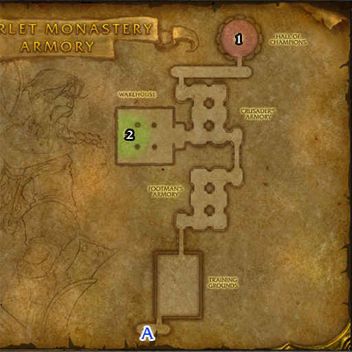

# 血色修道院: 军械库

**位置:** 提瑞斯法林地  
**适用等级:** 32-42 (25+)  
**人数上限:** 5人  

## 关键点/首领
- 钥匙: 血色十字军钥匙1
- A) 入口1
- [1) 赫洛德](../npc/3975.md)
- 2) Armory Quartermaster Daghelm3
- 0
- 小怪0
- 套装: Chain of the Scarlet Crusade5

## 相关任务
### 联盟
- [以圣光之名](../quest/1053.md)
### 部落
- [狂热之心](../quest/1113.md)
- [深入血色修道院](../quest/1048.md)
