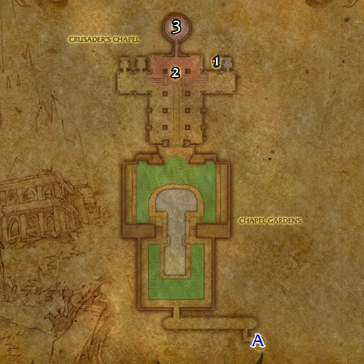

# 血色修道院: 大教堂

**位置:** 提瑞斯法林地  
**适用等级:** 35-45 (25+)  
**人数上限:** 5人  

## 关键点/首领
- 钥匙: 血色十字军钥匙1
- A) 入口1
- [1) 大检察官法尔班克斯](../npc/4542.md)
- [2) 血色十字军指挥官莫格莱尼](../npc/3976.md)
- [3) 大检察官怀特迈恩](../npc/3977.md)
- 0
- 小怪0
- 套装: Chain of the Scarlet Crusade5

## 相关任务
### 联盟
- [以圣光之名](../quest/1053.md)
- [卡拉杜斯的宝珠](../quest/40233.md)
- [血色的堕落](../quest/40935.md)
### 部落
- [狂热之心](../quest/1113.md)
- [深入血色修道院](../quest/1048.md)
