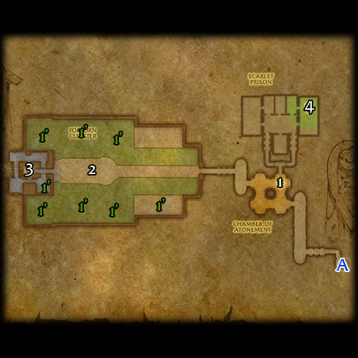

# 血色修道院: 墓地

**位置:** 提瑞斯法林地  
**适用等级:** 26-36 (25+)  
**人数上限:** 5人  

## 关键点/首领
- A) 入口1
- [1) 审讯员韦沙斯](../npc/3983.md)
- [沃瑞尔·森加斯](../npc/3981.md)
- [2) 瑟克恩 (天灾入侵)](../npc/14693.md)
- [3) 血法师萨尔诺斯](../npc/4543.md)
- [1') 铁脊死灵 (稀有)](../npc/6489.md)
- [永醒的艾希尔 (稀有)](../npc/6490.md)
- [亡灵勇士 (稀有)](../npc/6488.md)
- 4) Duke Dreadmoore2
- 0
- 小怪0
- 套装: Chain of the Scarlet Crusade5

## 相关任务
### 部落
- [沃瑞尔的复仇](../quest/1113.md)
- [狂热之心](../quest/1051.md)
- [Call the Headless Horseman (Daily - Seasonal)](../quest/60116.md)
