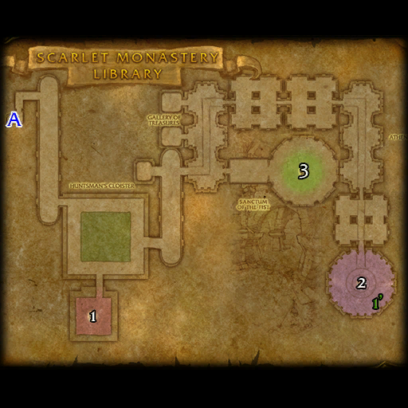

# 血色修道院: 图书馆

**位置:** 提瑞斯法林地  
**适用等级:** 29-39 (21+)  
**人数上限:** 5人  

## 关键点/首领
- A) 入口
- 1) 驯犬者洛克希 ([掉落](#boss-3974))
- 2) 秘法师杜安 ([掉落](#boss-6487))
- 1') 杜安的保险箱
- 3) Brother Wystan ([掉落](#boss--1))
- 
- 小怪
- 套装: Chain of the Scarlet Crusade

## 相关任务
### 联盟
- [泰坦神话](../quest/1053.md)
- [能量仪祭（法师任务）](../quest/1050.md)
- [以圣光之名](../quest/1951.md)
### 部落
- [狂热之心](../quest/1113.md)
- [知识的试炼](../quest/1048.md)
- [堕落者纲要](../quest/1049.md)
- [能量仪祭（法师任务）](../quest/1160.md)
- [深入血色修道院](../quest/1951.md)
