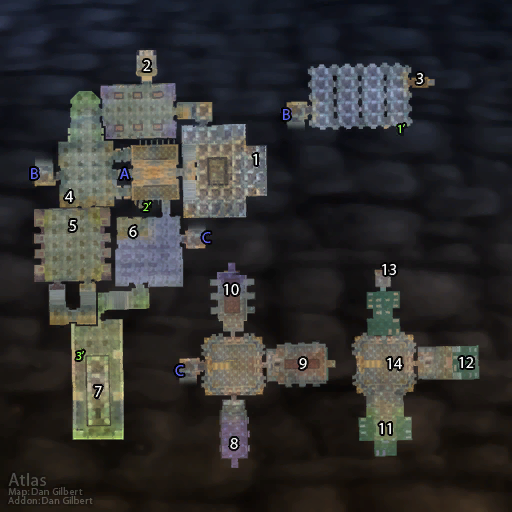

# 通灵学院

**位置:** 西瘟疫之地  
**适用等级:** 58-60 (45+)  
**人数上限:** 5人  

## 关键点/首领
- 声望: Argent Dawn2
- 钥匙: 骷髅钥匙1
- 钥匙: 观察室钥匙 (观察室)2
- 钥匙: 无辜者之血 (传令官基尔图诺斯)2
- 钥匙: 符咒火盆 (T0.5 召唤)3
- 钥匙: 预言水晶球 (死亡骑士达克雷尔)2
- A) 入口1
- B) 连接1
- C) 连接1
- [1) 基尔图诺斯的卫士](../npc/14861.md)
- 南海镇地契0
- [2) 传令官基尔图诺斯 (召唤)](../npc/10506.md)
- [3) 詹迪斯·巴罗夫](../npc/10503.md)
- 詹迪斯·巴罗夫的日记0
- 4) 塔伦米尔地契1
- [布莱克伍德公爵 (天灾入侵)](../npc/14695.md)
- [5) 血骨傀儡 (下层)](../npc/11622.md)
- [死亡骑士达克雷尔 (召唤)](../npc/14516.md)
- [6) 马杜克·布莱克波尔](../npc/10433.md)
- [维克图斯](../npc/10432.md)
- [7) 莱斯·霜语](../npc/10508.md)
- 布瑞尔地契0
- [库尔莫克 (召唤)](../npc/16118.md)
- [8) 讲师玛丽希亚](../npc/10505.md)
- [9) 瑟尔林·卡斯迪诺夫教授](../npc/11261.md)
- [10) 博学者普克尔特](../npc/10901.md)
- [11) 拉文尼亚](../npc/10507.md)
- [12) 阿雷克斯·巴罗夫](../npc/10504.md)
- 凯尔达隆地契0
- [13) 伊露希亚·巴罗夫女士](../npc/10502.md)
- [14) 通灵院长·加丁](../npc/1853.md)
- 1') 火炬拉杆1
- 2') 旧宝藏箱1
- 3') 炼金实验室1
- 0
- 小怪0
- 套装: Necropile Raiment2
- 套装: Cadaverous Garb2
- 套装: Bloodmail Regalia2
- 套装: Deathbone Guardian2
- 套装: Ironweave Battlesuit2
- T0/T0.5 套装1

## 相关任务
### 联盟
- [瘟疫之龙](../quest/5529.md)
- [健康的龙鳞](../quest/5582.md)
- [瑟尔林·卡斯迪诺夫教授](../quest/5382.md)
- [卡斯迪诺夫的恐惧之袋](../quest/5515.md)
- [传令官基尔图诺斯](../quest/5384.md)
- [巫妖莱斯·霜语](../quest/5466.md)
- [巴罗夫家族的宝藏](../quest/5343.md)
- [黎明先锋](../quest/4771.md)
- [瓶中的小鬼（术士任务）](../quest/7629.md)
- [瓦塔拉克饰品的左瓣](../quest/8969.md)
- [瓦萨拉克护符的右半块](../quest/8992.md)
- [帮法杉的忙。](../quest/40237.md)
### 部落
- [瘟疫之龙](../quest/5529.md)
- [健康的龙鳞](../quest/5582.md)
- [瑟尔林·卡斯迪诺夫教授](../quest/5382.md)
- [卡斯迪诺夫的恐惧之袋](../quest/5515.md)
- [传令官基尔图诺斯](../quest/5384.md)
- [巫妖莱斯·霜语](../quest/5466.md)
- [巴罗夫家族的宝藏](../quest/5341.md)
- [黎明先锋](../quest/4771.md)
- [瓶中的小鬼（术士任务）](../quest/7629.md)
- [瓦塔拉克饰品的左瓣](../quest/8969.md)
- [瓦萨拉克护符的右半块](../quest/8992.md)
- [帮法杉的忙。](../quest/40237.md)
