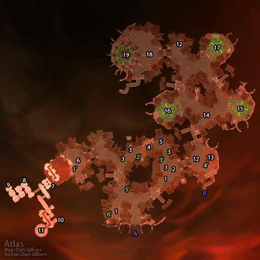

# 斯坦索姆

**位置:** 东瘟疫之地  
**适用等级:** 58-60 (45+)  
**人数上限:** 5人  

## 关键点/首领
- 声望: Argent Dawn2
- 钥匙: 血色十字军钥匙 (生者区域)2
- 钥匙: 城市大门钥匙 (亡灵区域)2
- 钥匙: 各种邮筒钥匙 (邮差马龙)2
- 钥匙: 符咒火盆 (T0.5 召唤)3
- A) 入口 (前部)2
- B) 入口 (侧面)2
- [1) 斯库尔 (稀有, 变化)](../npc/10393.md)
- [斯坦索姆信使](../npc/11082.md)
- [弗拉斯·希亚比](../npc/11058.md)
- [2) 埃提耶什 (召唤)](../npc/16387.md)
- [巴尔萨冯 (天灾入侵)](../npc/14684.md)
- [3) 弗雷斯特恩 (稀有, 变化)](../npc/10558.md)
- [4) 不可宽恕者](../npc/10516.md)
- [5) 遥语长者 (春节)](../npc/15607.md)
- [6) 悲惨的提米](../npc/10808.md)
- [7) 狂热的玛洛尔](../npc/11032.md)
- 玛洛尔的保险箱0
- [8) 红衣铸锤师 (召唤)](../npc/11120.md)
- 锻造设计图0
- [9) 炮手威利](../npc/10997.md)
- [10) 档案管理员加尔福特](../npc/10811.md)
- [11) 大十字军战士达索汉](../npc/10812.md)
- [巴纳札尔](../npc/10813.md)
- [索托斯 & 亚雷恩 (召唤)](../npc/16102.md)
- [12) 巴瑟拉斯镇长 (变化)](../npc/10435.md)
- [13) 奥里克斯](../npc/10917.md)
- [14) 石脊 (稀有, 游荡)](../npc/10809.md)
- [15) 安娜丝塔丽男爵夫人](../npc/10436.md)
- [黑衣守卫铸剑师 (召唤)](../npc/11121.md)
- 锻造设计图0
- [16) 奈鲁布恩坎](../npc/10437.md)
- [17) 苍白的玛勒基](../npc/10438.md)
- [18) 吞咽者拉姆斯登](../npc/10439.md)
- [19) 瑞文戴尔男爵](../npc/10440.md)
- [伊思达·哈尔蒙](../npc/16031.md)
- 1') 十字军广场邮箱1
- 2') 市场邮箱1
- 3') 节日小道邮箱1
- 4') 长者广场邮箱1
- 5') 国王广场邮箱1
- 6') 弗拉斯·希亚比的邮箱1
- [第三个邮筒已打开: 邮差马龙](../npc/11143.md)
- 0
- 小怪0
- 套装: The Postmaster2
- 套装: Ironweave Battlesuit2
- T0/T0.5 套装1

## 相关任务
### 联盟
- [血肉不会撒谎](../quest/5212.md)
- [活跃的探子](../quest/5213.md)
- [神圣之屋](../quest/5243.md)
- [弗拉斯·希亚比](../quest/5214.md)
- [永不安息的灵魂](../quest/5282.md)
- [爱与家庭（系列任务）](../quest/5848.md)
- [米奈希尔的礼物（系列任务）](../quest/5463.md)
- [奥里克斯的清算](../quest/5125.md)
- [档案管理员](../quest/5251.md)
- [可怕的真相](../quest/5262.md)
- [超越](../quest/5263.md)
- [死人的请求](../quest/8945.md)
- [瓦塔拉克饰品的左瓣](../quest/8968.md)
- [瓦塔拉克饰品的右瓣](../quest/8991.md)
- [埃提耶什，守护者的传说之杖](../quest/9269.md)
- [腐蚀（铸剑大师任务）](../quest/5307.md)
- [甜美的平静（铸锤大师任务）](../quest/5305.md)
- [光与影的平衡（牧师任务）](../quest/80401.md)
- [罗斯伦家族胸针](../quest/41000.md)
- [卡拉赞的钥匙之七](../quest/40826.md)
### 部落
- [血肉不会撒谎](../quest/5212.md)
- [活跃的探子](../quest/5213.md)
- [神圣之屋](../quest/5243.md)
- [弗拉斯·希亚比](../quest/5214.md)
- [永不安息的灵魂](../quest/5282.md)
- [爱与家庭（系列任务）](../quest/5848.md)
- [米奈希尔的礼物（系列任务）](../quest/5463.md)
- [奥里克斯的清算](../quest/5125.md)
- [档案管理员](../quest/5251.md)
- [可怕的真相](../quest/5262.md)
- [超越](../quest/5263.md)
- [死人的请求](../quest/8945.md)
- [瓦塔拉克饰品的左瓣](../quest/8968.md)
- [瓦塔拉克饰品的右瓣](../quest/8991.md)
- [埃提耶什，守护者的传说之杖](../quest/9269.md)
- [腐蚀（铸剑大师任务）](../quest/5307.md)
- [甜美的平静（铸锤大师任务）](../quest/5305.md)
- [吞咽者拉姆斯登](../quest/6163.md)
- [光与影的平衡（牧师任务）](../quest/80401.md)
- [罗斯伦家族胸针](../quest/41000.md)
- [卡拉赞的钥匙之七](../quest/40826.md)
