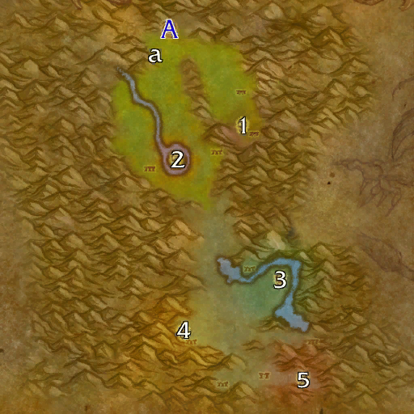

# 新月林地

**位置:** 灰谷  
**适用等级:** 32-38 (32+)  
**人数上限:** 5人  

## 关键点/首领
- A) 入口
- a) 卡拉纳尔的保险箱
- 1) 护林员恩格里斯 ([掉落](#boss-92107))
- 2) 守护者拉纳苏斯 ([掉落](#boss-92109))
- 3) 高阶女祭司阿勒西 ([掉落](#boss-92108))
- 4) 欺诈者弗纳克提斯 ([掉落](#boss-92111))
- 5) 拉克西斯大师 ([掉落](#boss-92110))
- 
- 小怪

## 相关任务
### 联盟
- [不明智的长老](../quest/40090.md)
- [猖獗的原林熊怪](../quest/40089.md)
- [卡拉纳尔之锤](../quest/40326.md)
- [新月林地](../quest/40091.md)
### 部落
- [不明智的长老](../quest/40090.md)
- [猖獗的原林熊怪](../quest/40089.md)
- [根除邪恶](../quest/40147.md)
