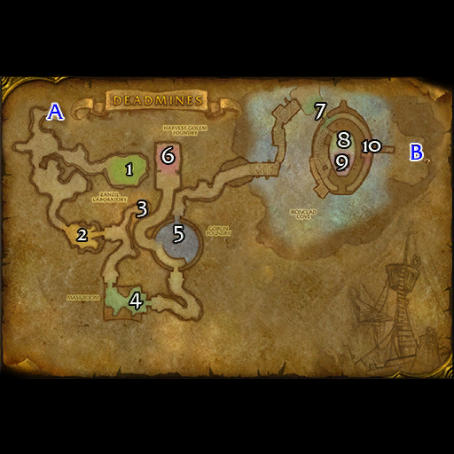
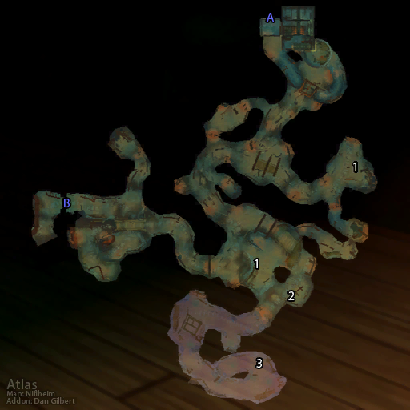

# 死亡矿井

**位置:** 西部荒野  
**适用等级:** 17-24 (10+)  
**人数上限:** 5人  

## 关键点/首领
- A) 入口1
- B) 出口1
- 1) 杰里德·维斯1
- [2) 拉克佐](../npc/644.md)
- [3) 矿工约翰森 (稀有)](../npc/3586.md)
- [4) 斯尼德](../npc/643.md)
- [斯尼德的伐木机](../npc/642.md)
- [5) 基尔尼格](../npc/1763.md)
- 6) 收割者-最后杰作1
- [7) 斯米特先生](../npc/646.md)
- [8) 曲奇](../npc/645.md)
- [9) 绿皮队长](../npc/647.md)
- [10) 艾德温·范克里夫](../npc/639.md)
- 0
- 小怪0
- 套装: Defias Leather2

## 相关任务
### 联盟
- [红色丝质面罩](../quest/214.md)
- [收集记忆](../quest/168.md)
- [我的兄弟……](../quest/167.md)
- [地底突袭](../quest/2040.md)
- [迪菲亚兄弟会（系列任务）](../quest/166.md)
- [正义试炼（圣骑士任务）](../quest/1654.md)
- [未寄出的信](../quest/373.md)
- [葛瑞森船长的复仇](../quest/40396.md)
- [收获傀儡之谜之九](../quest/40478.md)
- [关上水龙头](../quest/41392.md)
### 部落
- [原型机图纸](../quest/55005.md)
- [葛瑞森船长的复仇](../quest/40396.md)
- [部落防御者之斧](../quest/39998.md)
