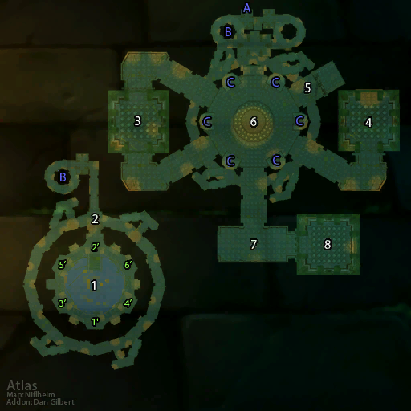

# 沉没的神庙

**位置:** 悲伤沼泽  
**适用等级:** 50-60 (35+)  
**人数上限:** 5人  

## 关键点/首领
- 又名: 阿塔哈卡神庙1
- 钥匙: 叶基亚的卷轴 (哈卡的化身)2
- A) 入口1
- B) 连接1
- C) 阳台小首领 (上层)2
- [加什尔](../npc/5713.md)
- [洛若尔](../npc/5714.md)
- [胡库](../npc/5715.md)
- [祖罗](../npc/5712.md)
- [米杉](../npc/5717.md)
- [祖罗尔](../npc/5716.md)
- 1) 哈卡祭坛1
- [阿塔拉利恩](../npc/8580.md)
- [2) 哈卡的后代 (游荡)](../npc/5708.md)
- [3) 哈卡的化身](../npc/8443.md)
- [4) 预言者迦玛兰](../npc/5710.md)
- [可悲的奥戈姆](../npc/5711.md)
- [5) 星歌长者 (春节)](../npc/15593.md)
- [6) 德姆塞卡尔](../npc/5721.md)
- [德拉维沃尔](../npc/5720.md)
- [7) 摩弗拉斯](../npc/5719.md)
- [哈扎斯](../npc/5722.md)
- [8) 伊兰尼库斯的阴影](../npc/5709.md)
- 精华之泉0
- [玛法里恩·怒风 (召唤)](../npc/15362.md)
- 1'-6') 雕像激活顺序1
- 0
- 小怪0

## 相关任务
### 联盟
- [进入阿塔哈卡神庙](../quest/1475.md)
- [深入神庙](../quest/3446.md)
- [雕像群的秘密](../quest/3447.md)
- [邪恶之雾](../quest/4143.md)
- [神灵哈卡（系列任务）](../quest/3528.md)
- [预言者迦玛兰](../quest/1446.md)
- [伊兰尼库斯精华（伊兰尼库斯的阴影掉落; [6]）](../quest/3373.md)
- [巨魔的羽毛（术士任务）](../quest/8422.md)
- [巫毒羽毛（战士任务）](../quest/8425.md)
- [更好的材料（德鲁伊任务）](../quest/9053.md)
- [神庙中的绿龙（猎人任务）](../quest/8232.md)
- [毁灭摩弗拉斯（法师任务）](../quest/8253.md)
- [摩弗拉斯之血（牧师任务）](../quest/8257.md)
- [碧蓝钥匙（盗贼任务）](../quest/8236.md)
- [铸造力量之石（圣骑士任务）](../quest/8418.md)
- [伊兰尼库斯，梦境之暴君](../quest/8733.md)
- [不择手段 Ⅳ](../quest/40400.md)
- [寐入梦境之三](../quest/40959.md)
- [裂隙行者法杖](../quest/41323.md)
### 部落
- [阿塔哈卡神庙](../quest/1445.md)
- [深入神庙](../quest/3446.md)
- [雕像群的秘密](../quest/3447.md)
- [除草器的燃料](../quest/4146.md)
- [神灵哈卡（系列任务）](../quest/3528.md)
- [预言者迦玛兰](../quest/1446.md)
- [伊兰尼库斯精华](../quest/3373.md)
- [巨魔的羽毛（术士任务）](../quest/8422.md)
- [巫毒羽毛（战士任务）](../quest/8425.md)
- [更好的材料（德鲁伊任务）](../quest/9053.md)
- [神庙中的绿龙（猎人任务）](../quest/8232.md)
- [毁灭摩弗拉斯（法师任务）](../quest/8253.md)
- [摩弗拉斯之血（牧师任务）](../quest/8257.md)
- [碧蓝钥匙（盗贼任务）](../quest/8236.md)
- [巫毒羽毛](../quest/8413.md)
- [伊兰尼库斯，梦境之暴君](../quest/8733.md)
- [不择手段 Ⅳ](../quest/40400.md)
- [莫尔奥格危机之七](../quest/40270.md)
- [寐入梦境之三](../quest/40959.md)
- [裂隙行者法杖](../quest/41323.md)
