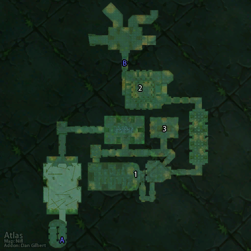

# 沉没的神庙 (入口)

**位置:** 悲伤沼泽  
**适用等级:** ?? (??+)  
**人数上限:** ??人  

## 关键点/首领
- A) 入口
- 集合石
- 玉龙 (稀有) ([掉落](#boss-1063))
- B) 沉没的神庙
- 1) 邪恶的卡萨卡兹 (稀有, 上层) ([掉落](#boss-5401))
- 2) 泽基斯 (稀有, 下层) ([掉落](#boss-5400))
- 3) 食尸者维萨克 (稀有) ([掉落](#boss-5399))

## 相关任务
### 联盟
- [进入阿塔哈卡神庙](../quest/1475.md)
- [沉没的神庙](../quest/3446.md)
- [深入神庙](../quest/3447.md)
- [雕像群的秘密](../quest/4143.md)
- [邪恶之雾](../quest/3528.md)
- [神灵哈卡（系列任务）](../quest/1446.md)
- [预言者迦玛兰](../quest/3373.md)
- [伊兰尼库斯精华](../quest/8422.md)
- [巨魔的羽毛（术士任务）](../quest/8425.md)
- [巫毒羽毛（战士任务）](../quest/9053.md)
- [巫毒羽毛（萨满任务）](../quest/8232.md)
- [更好的材料（德鲁伊任务）](../quest/8253.md)
- [神庙中的绿龙（猎人任务）](../quest/8257.md)
- [毁灭摩弗拉斯（法师任务）](../quest/8236.md)
- [摩弗拉斯之血（牧师任务）](../quest/8418.md)
- [碧蓝钥匙（盗贼任务）](../quest/8733.md)
- [铸造力量之石（圣骑士任务）](../quest/40400.md)
- [寐入梦境之三](../quest/40959.md)
### 部落
- [阿塔哈卡神庙](../quest/1445.md)
- [沉没的神庙](../quest/3446.md)
- [深入神庙](../quest/3447.md)
- [雕像群的秘密](../quest/4146.md)
- [除草器的燃料](../quest/3528.md)
- [神灵哈卡（系列任务）](../quest/1446.md)
- [预言者迦玛兰](../quest/3373.md)
- [伊兰尼库斯精华](../quest/8422.md)
- [巨魔的羽毛（术士任务）](../quest/8425.md)
- [巫毒羽毛（战士任务）](../quest/9053.md)
- [巫毒羽毛（萨满任务）](../quest/8232.md)
- [更好的材料（德鲁伊任务）](../quest/8253.md)
- [神庙中的绿龙（猎人任务）](../quest/8257.md)
- [毁灭摩弗拉斯（法师任务）](../quest/8236.md)
- [摩弗拉斯之血（牧师任务）](../quest/8413.md)
- [碧蓝钥匙（盗贼任务）](../quest/8733.md)
- [远古的邪恶（圣骑士）](../quest/40400.md)
- [莫尔奥格危机之七](../quest/40270.md)
- [寐入梦境之三](../quest/40959.md)
