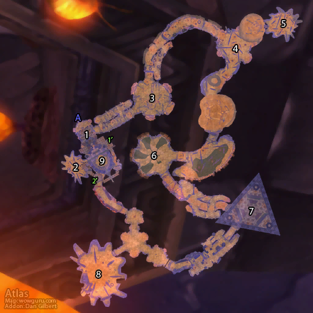

# 安其拉神庙

**位置:** 希利苏斯  
**适用等级:** 60+ (60+)  
**人数上限:** 40人  

## 关键点/首领
- 声望: Brood of Nozdormu
- A) 入口
- 1) 预言者斯克拉姆 (外面) ([掉落](#boss-15263))
- 2) 虫子三兄弟 (可选)
- 维姆 ([掉落](#boss-15544))
- 克里勋爵 ([掉落](#boss-15511))
- 亚尔基公主 ([掉落](#boss-15543))
- 3) 沙尔图拉 ([掉落](#boss-15516))
- 4) 顽强的范克瑞斯 ([掉落](#boss-15510))
- 5) 维希度斯 (可选) ([掉落](#boss-15299))
- 6) 哈霍兰公主 ([掉落](#boss-15509))
- 7) 双子皇帝
- 维克洛尔大帝 ([掉落](#boss-15276))
- 维克尼拉斯大帝 ([掉落](#boss-15275))
- 8) 奥罗 (可选) ([掉落](#boss-15517))
- 9) 克苏恩 ([掉落](#boss-15589))
- 1') 安多葛斯 ([掉落](#boss-15502))
- 温瑟拉 ([掉落](#boss-15504))
- 坎多斯特拉兹 ([掉落](#boss-15503))
- 2') 亚雷戈斯 ([掉落](#boss-15380))
- 凯雷斯特拉兹 ([掉落](#boss-15379))
- 梦境之龙麦琳瑟拉 ([掉落](#boss-15378))
- 
- 小怪
- 安其拉附魔
- 安其拉神庙套装
- 安其拉开门任务链
- 
- 伤害: 自然

## 相关任务
### 联盟
- [克苏恩的遗产](../quest/8801.md)
- [卡利姆多的救世主](../quest/8784.md)
### 部落
- [克苏恩的遗产](../quest/8801.md)
- [卡利姆多的救世主](../quest/8784.md)
