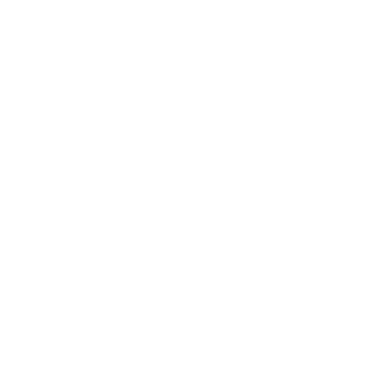

# 交通路线

**位置:** 艾泽拉斯  
**适用等级:** ?? (??+)  
**人数上限:** ??人  

## 关键点/首领
- 1) 鲁瑟兰村, 泰达希尔2
- 2) 奥伯丁, 黑海岸2
- 7) 羽月要塞, 菲拉斯2
- 8) 塞拉摩岛, 尘泥沼泽2
- 9) 阿尔萨拉斯, 萨拉斯高地2
- 12) 米奈希尔港, 湿地2
- 13) 铁炉堡, 丹莫罗2
- 15) 暴风城, 艾尔文森林2
- 0
- 3) 奥格瑞玛, 贫瘠之地2
- 4) 怒水港, 贫瘠之地2
- 6) 雷霆崖, 莫高雷2
- 10) 幽暗城, 提瑞斯法林地2
- 11) 恶齿村, 辛特兰2
- 14) 卡加斯, 荒芜之地2
- 16) 格罗姆高营地, 荆棘谷2
- 0
- 5) 棘齿城, 贫瘠之地2
- 17) 藏宝海湾, 荆棘谷2
