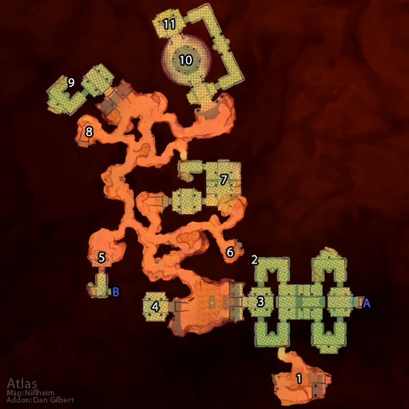

# 奥达曼

**位置:** 荒芜之地  
**适用等级:** 41-51 (30+)  
**人数上限:** 5人  

## 关键点/首领
- 钥匙: 史前法杖 (艾隆纳亚)
- A) 入口 (前部)
- B) 入口 (后退)
- 1) 巴尔洛戈 ([掉落](#boss-6906))
- “迅捷的”埃里克 ([掉落](#boss-6907))
- 奥拉夫 ([掉落](#boss-6908))
- 巴尔洛戈的箱子
- 显眼的石罐
- 2) 圣骑士的遗体 ([掉落](#boss-6912))
- 3) 鲁维罗什 ([掉落](#boss-6910))
- 4) 艾隆纳亚 ([掉落](#boss-7228))
- 5) 黑曜石哨兵 ([掉落](#boss-7023))
- 6) 安诺拉 ([掉落](#boss-11073))
- 7) 古代的石头看守者 ([掉落](#boss-7206))
- 8) 加加恩·火锤 ([掉落](#boss-7291))
- 意志之匾
- 暗影熔炉地窖
- 9) 格瑞姆洛克 ([掉落](#boss-4854))
- 10) 阿扎达斯 (下层) ([掉落](#boss-2748))
- 11) 诺甘农圆盘 (下层)
- 古代宝藏 (下层)
- 
- 小怪

## 相关任务
### 联盟
- [一线希望](../quest/721.md)
- [铁趾的护符](../quest/722.md)
- [意志石板](../quest/1139.md)
- [能量石](../quest/2418.md)
- [阿戈莫德的命运](../quest/704.md)
- [化解灾难](../quest/709.md)
- [失踪的矮人](../quest/2398.md)
- [密室](../quest/2240.md)
- [破碎的项链](../quest/2198.md)
- [回到奥达曼](../quest/2200.md)
- [寻找宝石](../quest/2201.md)
- [修复项链](../quest/2204.md)
- [奥达曼的蘑菇](../quest/17.md)
- [失而复得](../quest/1360.md)
- [白金圆盘](../quest/2278.md)
- [奥达曼的能量源（法师任务）](../quest/1956.md)
- [偷一个核心](../quest/40129.md)
### 部落
- [能量石](../quest/2418.md)
- [化解灾难](../quest/709.md)
- [搜寻项链](../quest/2283.md)
- [搜寻项链，再来一次](../quest/2284.md)
- [翻译日记](../quest/2318.md)
- [寻找宝贝](../quest/2339.md)
- [奥达曼的蘑菇](../quest/2202.md)
- [寻找宝藏](../quest/2342.md)
- [白金圆盘](../quest/2278.md)
- [奥达曼的能量源（法师任务）](../quest/1956.md)
- [征用一个核心](../quest/40131.md)
