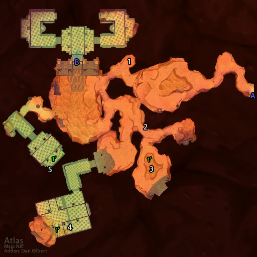

# 奥达曼 (入口)

**位置:** 荒芜之地  
**适用等级:** ?? (??+)  
**人数上限:** ??人  

## 关键点/首领
- A) 入口1
- B) 奥达曼1
- [1) 铁趾格雷兹](../npc/2909.md)
- [2) 马格雷甘·深影 (游荡)](../npc/2932.md)
- 3) 莱恩之匾1
- 4) 克罗姆·粗臂的箱子1
- 5) 加勒特的宝箱1
- [1') 挖掘专家舒尔弗拉格 (稀有, 变化)](../npc/7057.md)

## 相关任务
### 联盟
- [一线希望](../quest/721.md)
- [铁趾的护符](../quest/722.md)
- [意志石板](../quest/1139.md)
- [能量石](../quest/2418.md)
- [阿戈莫德的命运](../quest/704.md)
- [化解灾难](../quest/709.md)
- [失踪的矮人](../quest/2398.md)
- [密室](../quest/2240.md)
- [破碎的项链](../quest/2198.md)
- [回到奥达曼](../quest/2200.md)
- [寻找宝石](../quest/2201.md)
- [修复项链](../quest/2204.md)
- [奥达曼的蘑菇](../quest/17.md)
- [失而复得](../quest/1360.md)
- [白金圆盘](../quest/2278.md)
- [奥达曼的能量源（法师任务）](../quest/1956.md)
- [偷一个核心](../quest/40129.md)
### 部落
- [能量石](../quest/2418.md)
- [化解灾难](../quest/709.md)
- [搜寻项链](../quest/2283.md)
- [搜寻项链，再来一次](../quest/2284.md)
- [翻译日记](../quest/2318.md)
- [寻找宝贝](../quest/2339.md)
- [奥达曼的蘑菇](../quest/2202.md)
- [寻找宝藏](../quest/2342.md)
- [白金圆盘](../quest/2278.md)
- [奥达曼的能量源（法师任务）](../quest/1956.md)
- [征用一个核心](../quest/40131.md)
