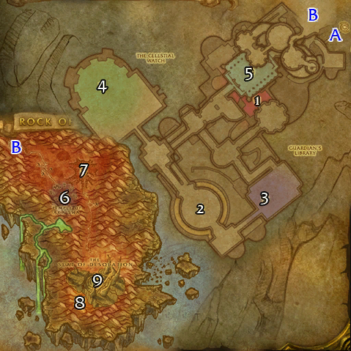

# 卡拉赞之塔

**位置:** 逆风小径  
**适用等级:** 60+ (60+)  
**人数上限:** 40人  

## 关键点/首领
- 需要开门任务
- 钥匙: 上层卡拉赞塔之钥
- A) 入口
- B) 连接
- 1) 守护者纳尔穆恩 ([掉落](#boss--1))
- 2) 魔网观察者因塔苟斯 ([掉落](#boss--1))
- 3) 阿诺玛鲁斯 ([掉落](#boss--1))
- 4) 麦迪文的回响 ([掉落](#boss--1))
- 5) 国王 ([掉落](#boss--1))
- 6) 桑夫·塔斯达尔 ([掉落](#boss--1))
- 7) 破碎者鲁普图兰 ([掉落](#boss--1))
- 8) 库鲁尔 ([掉落](#boss--1))
- 9) 孟菲斯托斯 ([掉落](#boss--1))
- 
- 小怪
- Karazhan Sets
