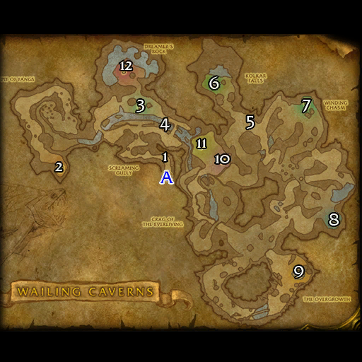

# 哀嚎洞穴

**位置:** 贫瘠之地  
**适用等级:** 17-24 (10+)  
**人数上限:** 5人  

## 关键点/首领
- A) 入口1
- [1) 纳拉雷克斯的信徒](../npc/3678.md)
- [2) 考布莱恩领主](../npc/3669.md)
- [3) 安娜科德拉女士](../npc/3671.md)
- [4) 克雷什](../npc/3653.md)
- [5) 变异精灵龙 (稀有)](../npc/5912.md)
- 6) Zandara Windhoof2
- [7) 皮萨斯领主](../npc/3670.md)
- [8) 斯卡姆](../npc/3674.md)
- 9) Vangros1
- [10) 瑟芬迪斯领主 (上层)](../npc/3673.md)
- [11) 永生者沃尔丹 (上层)](../npc/5775.md)
- [12) 吞噬者穆坦努斯](../npc/3654.md)
- [纳拉雷克斯](../npc/3679.md)
- 0
- 小怪0
- 套装: Embrace of the Viper4

## 相关任务
### 联盟
- [变异皮革](../quest/1486.md)
- [港口的麻烦](../quest/959.md)
- [智慧饮料](../quest/1491.md)
- [清除变异者](../quest/1487.md)
- [发光的碎片](../quest/6981.md)
- [毒蛇花](../quest/60125.md)
- [陷入梦魇](../quest/60124.md)
- [杂草丛生](../quest/41363.md)
### 部落
- [变异皮革](../quest/1486.md)
- [港口的麻烦](../quest/959.md)
- [毒蛇花](../quest/962.md)
- [智慧饮料](../quest/1491.md)
- [清除变异者](../quest/1487.md)
- [尖牙德鲁伊（连续任务）](../quest/914.md)
- [发光的碎片](../quest/6981.md)
- [奥术武器](../quest/80312.md)
- [与科卡尔的梦对抗](../quest/41367.md)
