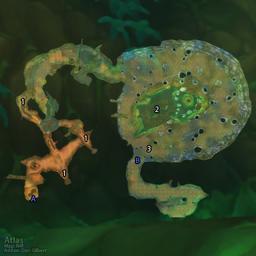

# 哀嚎洞穴 (入口)

**位置:** 贫瘠之地  
**适用等级:** ?? (??+)  
**人数上限:** ??人  

## 关键点/首领
- A) 入口1
- B) 哀嚎洞穴1
- [1) 疯狂的马格利什 (变化)](../npc/3655.md)
- [2) 鞭笞者特里高雷 (稀有)](../npc/3652.md)
- [3) 博艾恩 (稀有)](../npc/3672.md)
- 0
- 入口上方：0
- [厄布鲁](../npc/5768.md)
- [纳尔帕克](../npc/5767.md)
- [卡尔丹·暗月](../npc/5783.md)
- [瓦多尔](../npc/5784.md)

## 相关任务
### 联盟
- [变异皮革](../quest/1486.md)
- [港口的麻烦](../quest/959.md)
- [智慧饮料](../quest/1491.md)
- [清除变异者](../quest/1487.md)
- [发光的碎片](../quest/6981.md)
- [毒蛇花](../quest/60125.md)
- [陷入梦魇](../quest/60124.md)
- [杂草丛生](../quest/41363.md)
### 部落
- [变异皮革](../quest/1486.md)
- [港口的麻烦](../quest/959.md)
- [毒蛇花](../quest/962.md)
- [智慧饮料](../quest/1491.md)
- [清除变异者](../quest/1487.md)
- [尖牙德鲁伊（连续任务）](../quest/914.md)
- [发光的碎片](../quest/6981.md)
- [奥术武器](../quest/80312.md)
- [与科卡尔的梦对抗](../quest/41367.md)
