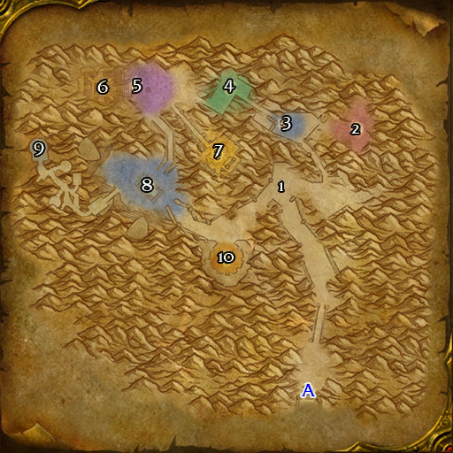

# 祖尔法拉克

**位置:** 塔纳利斯  
**适用等级:** 44-54 (30+)  
**人数上限:** 5人  

## 关键点/首领
- 钥匙: 祖尔法拉克之槌 (加兹瑞拉)
- A) 入口
- 1) 泽雷利斯 (稀有, 游荡) ([掉落](#boss-10082))
- 2) 安图苏尔 ([掉落](#boss-8127))
- 3) 殉教者塞卡 ([掉落](#boss-7272))
- 4) 巫医祖穆拉恩 ([掉落](#boss-7271))
- 祖尔法拉克阵亡英雄 ([掉落](#boss-7276))
- 5) 耐克鲁姆 ([掉落](#boss-7796))
- 暗影祭司塞瑟斯 ([掉落](#boss-7275))
- 灰尘怨灵 (稀有) ([掉落](#boss-10081))
- 6) 布莱中士 ([掉落](#boss-7604))
- 维格利·爆管 ([掉落](#boss-7607))
- 穆尔塔·酷肠 ([掉落](#boss-7608))
- 渡鸦 ([掉落](#boss-7605))
- 欧罗·血眼 ([掉落](#boss-7606))
- 沙怒刽子手 ([掉落](#boss-7274))
- 7) 乌克兹·沙顶 ([掉落](#boss-7267))
- 卢兹鲁 ([掉落](#boss-7797))
- 8) 水占师维蕾萨 ([掉落](#boss-7795))
- 加兹瑞拉 (召唤) ([掉落](#boss-7273))
- 蛮鬃长者 (春节) ([掉落](#boss-15578))
- 9) 年迈的泽尔杰布 ([掉落](#boss--1))
- 10) 迅捷的拉扎尔 ([掉落](#boss--1))
- 杉达尔·沙掠者 (稀有) ([掉落](#boss-10080))
- 
- 小怪

## 相关任务
### 联盟
- [巨魔调和剂](../quest/2991.md)
- [圣甲虫的壳](../quest/3042.md)
- [深渊皇冠](../quest/2865.md)
- [耐克鲁姆的徽章（系列任务）](../quest/2846.md)
- [摩沙鲁的预言（系列任务）](../quest/3527.md)
- [探水棒](../quest/2768.md)
- [加兹瑞拉](../quest/2770.md)
- [沙地漂流](../quest/40519.md)
### 部落
- [蜘蛛之神（系列任务）](../quest/2936.md)
- [巨魔调和剂](../quest/3042.md)
- [圣甲虫的壳](../quest/2865.md)
- [深渊皇冠](../quest/2846.md)
- [摩沙鲁的预言（系列任务）](../quest/3527.md)
- [探水棒](../quest/2768.md)
- [加兹瑞拉](../quest/2770.md)
- [沙地漂流](../quest/40519.md)
- [乌克兹·沙顶的尽头](../quest/40527.md)
