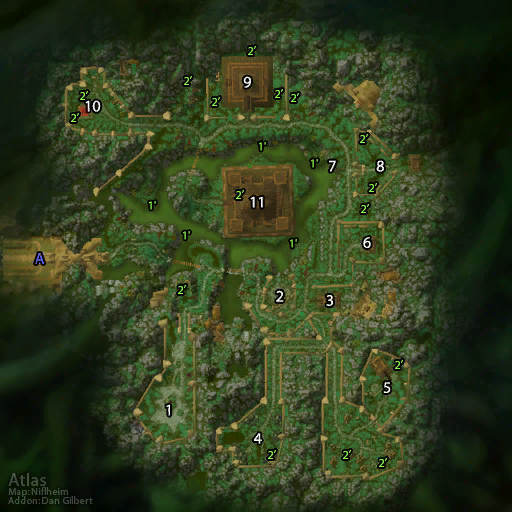

# 祖尔格拉布

**位置:** 荆棘谷  
**适用等级:** 60+ (60+)  
**人数上限:** 20人  

## 关键点/首领
- 声望: Zandalar Tribe
- 钥匙: 古拉巴什疯狂魔精 (疯狂之缘)
- 钥匙: 臭泥鱼诱饵 (加兹兰卡)
- A) 入口
- 1) 高阶女祭司耶克里克 (蝙蝠) ([掉落](#boss-14517))
- 2) 高阶祭司温诺希斯 (蛇) ([掉落](#boss-14507))
- 3) 无法安息的赞札 ([掉落](#boss-15042))
- 4) 高阶女祭司玛尔里 (蜘蛛) ([掉落](#boss-14510))
- 5) 血领主曼多基尔 (迅猛龙, 可选) ([掉落](#boss-11382))
- 奥根 ([掉落](#boss-14988))
- 6) 疯狂之缘 (可选)
- 格里雷克 (随机) ([掉落](#boss-15082))
- 哈札拉尔 (随机) ([掉落](#boss-15083))
- 雷纳塔基 (随机) ([掉落](#boss-15084))
- 乌苏雷 (随机) ([掉落](#boss-15085))
- 7) 加兹兰卡 (可选, 召唤) ([掉落](#boss-15114))
- 8) 高阶祭司塞卡尔 (丛林虎) ([掉落](#boss-14509))
- 狂热者札斯 (Rogue) ([掉落](#boss-11348))
- 狂热者洛卡恩 (Shaman) ([掉落](#boss-11347))
- 9) 高阶女祭司娅尔罗 (黑豹) ([掉落](#boss-14515))
- 10) 妖术师金度 (可选) ([掉落](#boss-11380))
- 11) 哈卡 ([掉落](#boss-14834))
- 1') 混浊的水
- 2') 厄运巫毒堆
- 
- 小怪
- 随机首领掉落
- 套装: Primal Blessing
- 套装: The Twin Blades of Hakkari
- 祖尔格拉布戒指套装
- 祖尔格拉布套装
- 祖尔格拉布附魔
- 
- 伤害: 自然

## 相关任务
### 联盟
- [祭司的头颅](../quest/8201.md)
- [哈卡之心](../quest/8183.md)
- [纳特的卷尺](../quest/8227.md)
- [完美的毒药](../quest/9023.md)
### 部落
- [祭司的头颅](../quest/8201.md)
- [哈卡之心](../quest/8183.md)
- [纳特的卷尺](../quest/8227.md)
- [完美的毒药](../quest/9023.md)
